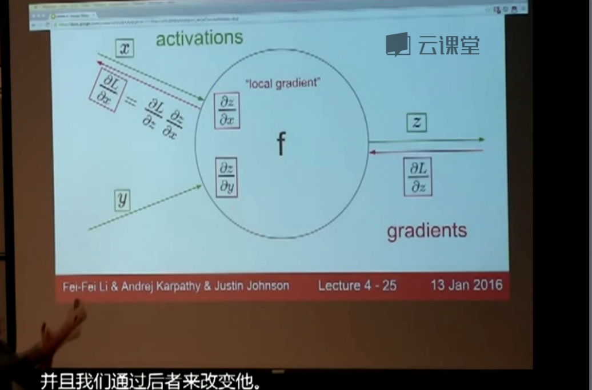

# CNN 卷积神经网络
链接: <https://zhuanlan.zhihu.com/p/26645110>
$$ L_{i}=-log p_{y_{i}}\left ( \frac{e^{f_{y_{i}}}}{\sum_{j}{e^{f_{j}}}} \right )=-f_{y_{i}} + log\sum_{j}{e^{f_{j}}} )$$

formula2: $$n!=x$$

## 数据输入层:Input layer


数据 | 图像的输入

## 卷积计算层:Conv layer

- 局部关联。每个神经元看作一个filter
- 窗口(receptive field | 感受野)滑动，filter对局部数据计算
- 涉及的概念:

  - 深度 / depth 深度代表5个圆圈的个数
  - 步长 / stride 滑动窗口的步长
  - 填充值 / zero-padding 在最左侧和最右侧(最左上和最右上两个点)补0


input : 227 x 227 x 3 images

First layer (conv1) : 96 11 x 11 filters applied at stride 4 => output colume size hint: (227-11)/4 + 1=55 output volume 55 x 55 x 96 parameters: (11 _11_ 3) * 96 = 35K

Second layer (pool1): 3 x 3 filters applied at stride 2 output volume size ? hint : (55-3)/2 + 1 = 27 parameters : 0 

### 链式法则

链式法则就是用输出结果的全局梯度乘以局部梯度

链路中所有的局部梯度相乘，这个过程就叫做反向传播

链式法则通常包含两部分，局部梯度和后一层的梯度相乘



#### 卷积层计算原理

- 1.深度原理过程图可参照如下链接: <http://cs231n.github.io/assets/conv-demo/index.html> 窗口的大小和步长是超参数
- 2.计算原理图 其中的卷积核是固定核的，例如你29_29的图片，就用5_5的核。 这些都是经验。 当然你也可以用大些的。然后核的具体的值，就是要训练出来的，核的初始化的话，若果你的输入是0-1之前，那么核值也可以初始化在0-1之间，不会有太大的误差。

  

- 3.参数共享机制

  ```
  \-   假设每个神经元连接数据窗的权重是固定的
  \-   固定每个神经元连接权重，可以看做模板 每个神经元只关注一个特性
  \-   需要估算的权重个数减少: AlexNet 1亿 => 3.5w    一组固定的权重和不同窗口内数据做内积: 卷积
  ```

  ## 反向传播的过程

  对于每次更新都要进行完整的一次前馈和反馈，当进行更新时需要梯度要前馈给样本，然后进行反向求导得到梯度，然后根据得到的梯度进行权值的微调，来完成权值的更新。（通过前馈得到损失，通过反馈得到梯度，通过对梯度的使用来完成权值的更新）这就是圣经网络的训练过程中内部变化。前馈->反馈->更新->前馈->反馈->更新

## 激活层:ReLU layer

- #### ReLU 的作用 ?

   把卷积层输出结果做非线性映射。
- #### 为什么引入非线性激活函数ReLU ?

  如果不用激励函数（其实相当于激励函数是f(x) = x），在这种情况下你每一层输出都是上层输入的线性函数，很容易验证，无论你神经网络有多少层，输出都是输入的线性组合，与没有隐藏层效果相当，这种情况就是最原始的感知机（Perceptron）了。正因为上面的原因，我们决定引入非线性函数作为激励函数，这样深层神经网络就有意义了（不再是输入的线性组合，可以逼近任意函数）。最早的想法是sigmoid函数或者tanh函数，输出有界，很容易充当下一层输入（以及一些人的生物解释balabala）。第一，采用sigmoid等函数，算激活函数时（指数运算），计算量大，反向传播求误差梯度时，求导涉及除法，计算量相对大，而采用Relu激活函数，整个过程的计算量节省很多。第二，对于深层网络，sigmoid函数反向传播时，很容易就会出现梯度消失的情况（在sigmoid接近饱和区时，变换太缓慢，导数趋于0，这种情况会造成信息丢失，从而无法完成深层网络的训练。第三，Relu会使一部分神经元的输出为0，这样就造成了网络的稀疏性，并且减少了参数的相互依存关系，缓解了过拟合问题的发生（以及一些人的生物解释balabala）。当然现在也有一些对relu的改进，比如prelu，random relu等，在不同的数据集上会有一些训练速度上或者准确率上的改进，具体的大家可以找相关的paper看。多加一句，现在主流的做法，会多做一步batch normalization，尽可能保证每一层网络的输入具有相同的分布[1]。而最新的paper[2]，他们在加入bypass connection之后，发现改变batch normalization的位置会有更好的效果。 现ReLU更容易学习优化。因为其分段线性性质，导致其前传，后传，求导都是分段线性。而传统的sigmoid函数，由于两端饱和，在传播过程中容易丢弃信息：

  普适近似理论（universal approximation theorem）[1~2]表明，带有线性输出层和至少一层带有"挤压"性质的激活函数的隐含层的前馈神经网络，在隐含层具有足够神经元数的情况下，可以以任意精度近似任何一个从有限空间到另一个有限空间映射的Borel可测函数（定义在有界闭集上的任意连续函数是Borel可测的）。所以，要想网络获得普适近似器的性质，一个必须点是"要有带有"挤压"性质的激活函数"。这里的"挤压"性质是因为早期对神经网络的研究用的是sigmoid类函数，所以对其数学性质的研究也主要基于这一类性质：将输入数值范围挤压到一定的输出数值范围。（后来发现，其他性质的激活函数也可以使得网络具有普适近似器的性质，如ReLU [3]）这可以说是激活函数的理论作用了，使神经网络成为一个普适近似器。当然，激活函数有很多种，并不是每个都能有以上作用（例如单位函数作为激活函数，但其实单位函数作为隐含层激活函数，可以达到以减少参数和过滤数据的作用：


  $$W^{t}= U^{t}V^{t}x$$


  原来一个的线性权重矩阵的功能由两个小矩阵


  $$x\times q+q\times p$$


  代替),也有的激活函数具有更多作用。那为什么ReLU好过sigmoid类的呢？因为它具有其他优良性质[4]：梯度传播性质的解释（最重要的，因为目前，对神经网络训练而言，梯度这东西最重要）：梯度消失是因为有saturation regime的存在，而ReLU线性部分能很好传播梯度，而置0部分本身就是为了稀疏性而牺牲gradient的。稀疏性性质的解释：ReLU更易产生稀疏性，而数学上来看，你可以认为这是一种线性变化，然后再投影，投到特征维度上
  $$f(x) = Max(0, \sum W_{i}X_{i})$$

- #### 激活函数包含

  - Sigmoid
  - Tanh(双曲正切)
  - ReLU
  - Leaky ReLU
  - ELU
  - Maxout

- #### 激励层(实际经验)

  ```
  -   1  CNN尽量不要用sigmoid!不要用sigmoid!不要用sigmoid!
  -   2  首先试RELU，因为快，但要小心点
  -   3  如果2失效，请用Leaky ReLU或者Maxout
  -   4  某些情况下tanh倒是有不错的结果，但是很少
  -    5  在batch normalization的过程中期望激励过后的结果是高斯分布的.
  ```

  ## 池化层:pooling layer

- #### 深入浅出池化层(pooling)

  在通过卷积获得了特征 (features) 之后，下一步我们希望利用这些特征去做分类。理论上讲，人们可以用所有提取得到的特征去训练分类器，例如 softmax 分类器，但这样做面临计算量的挑战。 例如：对于一个 96X96 像素的图像，假设我们已经学习得到了400个定义在8X8输入上的特征，每一个特征和图像卷积都会得到一个 (96 − 8 + 1) _(96 − 8 + 1) = 7921 维的卷积特征，由于有 400 个特征，所以每个样例 (example) 都会得到一个 $ 89^{2}$_ 400 = 3168400 维的卷积特征向量。学习一个拥有超过 3 百万特征输入的分类器十分不便，并且容易出现过拟合 (over-fitting)。为了解决这个问题，首先回忆一下，我们之所以决定使用卷积后的特征是因为图像具有一种"静态性"的属性，这也就意味着在一个图像区域有用的特征极有可能在另一个区域同样适用。因此，为了描述大的图像，一个很自然的想法就是对不同位置的特征进行聚合统计，例如，人们可以计算图像一个区域上的某个特定特征的平均值 (或最大值)。这些概要统计特征不仅具有低得多的维度 (相比使用所有提取得到的特征)，同时还会改善结果(不容易过拟合)。这种聚合的操作就叫做池化 (pooling)，有时也称为平均池化或者最大池化 (取决于计算池化的方法)。

  ```
  下图显示池化如何应用于一个图像的四块不重合区域(这一点与卷积是不同的).
  ```

   最常见的池化操作为平均池化mean pooling和最大池化max pooling：

  平均池化：计算图像区域的平均值作为该区域池化后的值。

  最大池化：选图像区域的最大值作为该区域池化后的值。

- #### 池化的特点

- ##### 1.池化单元的平移不变性

  如果人们选择图像中的连续范围作为池化区域，并且只是池化相同(重复)的隐藏单元产生的特征，那么，这些池化单元就具有平移不变性 (translation invariant)。这就意味着即使图像经历了一个小的平移之后，依然会产生相同的 (池化的) 特征。在很多任务中 (例如物体检测、声音识别)，我们都更希望得到具有平移不变性的特征，因为即使图像经过了平移，样例(图像)的标记仍然保持不变。例如，如果你处理一个MNIST数据集的数字，把它向左侧或右侧平移，那么不论最终的位置在哪里，你都会期望你的分类器仍然能够精确地将其分类为相同的数字。

  (_MNIST 是一个手写数字库识别库: MNIST handwritten digit database, Yann LeCun, Corinna Cortes and Chris Burges_)

- ##### 2.显著减少参数数量

  通过卷积操作获得了图像的特征之后，若直接用该特征去做分类则面临计算量的挑战。而Pooling的结果可以使得特征减少，参数减少。 例如：对于一个 96X96 像素的图像，假设我们已经学习得到了400个定义在8X8输入上的特征，每一个特征和图像卷积都会得到一个 (96 − 8 + 1) _(96 − 8 + 1) = 7921 维的卷积特征，由于有 400 个特征，所以每个样本都会得到一个 892_ 400 = 3168400 维的卷积特征向量。学习一个拥有超过 3 百万特征输入的分类器十分不便，并且容易出现过拟合 (over-fitting)

- #### 池化的方式

- ##### 一般池化（General Pooling）

  ```
  1\.  mean-pooling，即对邻域内特征点只求平均，对背景保留更好;
  2\.  max-pooling，即对邻域内特征点取最大，对纹理提取更好;
  3\.  Stochastic-pooling，介于两者之间，通过对像素点按照数值大小赋予概率，再按照概率进行亚采样;

  特征提取的误差主要来自两个方面：
  (1)邻域大小受限造成的估计值方差增大；
  (2)卷积层参数误差造成估计均值的偏移。一般来说，mean-pooling能减小第一种误差，更多的保留图像的背景信息，max-pooling能减小第二种误差，更多的保留纹理信息。在平均意义上，与mean-pooling近似，在局部意义上，则服从max-pooling的准则。
  ```

  

- #### 问题

- ###### 卷积神经网络(CNN)中卷积层与池化层如何进行BP残差传递与参数更新？

- ###### 卷积层的残差BP传导似乎与普通神经网络的传导方式不完全相同，参数的更新具体是如何进行的？

- ###### 池化层正向进行池化损失了一些信息（如2*2->1），逆向传导误差时如何从一个误差传导为多个误差？

- ###### 另外，具体到如Tensorflow，有多个卷积层，第一层卷积得到32个特征，第二层卷积若64个特征，第一层到第二层的卷积是如何进行的？是第一层每一个特征图卷积对应第二层卷积的两个特征？

- ###### 如何保证同一个卷基层每个特征学习到的是不同的特征？

- ###### VGG16网络的finetune后训练和测试的准确率不同？

- ###### caffe的finetuning是如何更新网络参数的？


  1、会更新，finetune的过程相当于继续训练，跟直接训练的区别是初始化的时候：\ a. 直接训练是按照网络定义指定的方式初始化（如高斯随机初始化）\ b. finetune是用你已经有的参数文件来初始化（就是之前训练好的caffemodel） 2、嗯，这个问题有两种情况：比如有4个全连接层A->B->C->D\ a. 你希望C层的参数不会改变，C前面的AB层的参数也不会改变，这种情况也就是D层的梯度不往前反向传播到D层的输入blob（也就是C层的输出blob 没有得到梯度），你可以通过设置D层的propagate_down为false来做到。

  ```
       propagate_down的数量与输入blob的数量相同，假如你某个层有2个输入blob，那么你应该在该layer的Param里面写上两行：         propagate_down : 0    # 第1个输入blob不会得到反向传播的梯度         propagate_down : 0    # 第2个输入blob不会得到反向传播的梯度         这样的话，你这个layer的梯度就不会反向传播啦，前面的所有layer的参数也就不会改变了    
  ```

  b. 你希望C层的参数不会改变，但是C前面的AB层的参数会改变，这种情况，只是固定了C层的参数，C层得到的梯度依然会反向传播给前面的B层。只需要将对应的参数blob的学习率调整为0：你在layer里面加上param { lr_mult: 0 }就可以了，比如全连接层里面： layer {\

  ```
  type: "InnerProduct"\
  param { # 对应第1个参数blob的配置，也就是全连接层的参数矩阵的配置\
      lr_mult: 0 # 学习率为0，其他参数可以看caffe.proto里面的ParamSpec这个类型\
  }\
  param { # 对应第2个参数blob的配置，也就是全连接层的偏置项的配置\
      lr_mult: 0 # 学习率为0\
      }
  }
  ```

  Pooling Layer常用的就两种：MaxPooling和AveragePooling

  1. Average Pooling的bp好算，直接求导可得，就是1/n
  2. Max Pooling比较有意思，forward的时候需要记录 每个窗口内部最大元素的位置，然后bp的时候，对于窗口内最大元素的gradient是1，否则是0。原理和ReLu是一样的。参考：

  <http://www.slideshare.net/kuwajima/cnnbp> 对于Conv Layer多个filter，我的理解是这样的： 1.第一层有32个filter，对于下一层就有32个input 2.第二层的每一个filter，都会对着32个input进行一遍conv操作，得到32个output，最终的output是这32个output的叠加。

同一般机器学习算法，先定义Loss function，衡量和实际结果之间差距。 找到最小化损失函数的W和b，CNN中用的算法是SGD，SGD需要计算W和b的偏导 BP算法就是计算偏导用的。 BP算法的核心是求导链式法则。

## 全连接层:Full connection layer

- ##### 全连接层到底什么用？

  1. 全连接层（fully connected layers，FC）在整个卷积神经网络中起到"分类器"的作用。如果说卷积层、池化层和激活函数层等操作是将原始数据映射到隐层特征空间的话，全连接层则起到将学到的"分布式特征表示"映射到样本标记空间的作用。在实际使用中，全连接层可由卷积操作实现：对前层是全连接的全连接层可以转化为卷积核为1x1的卷积；而前层是卷积层的全连接层可以转化为卷积核为hxw的全局卷积，h和w分别为前层卷积结果的高和宽（注1）。
  2. 目前由于全连接层参数冗余（仅全连接层参数就可占整个网络参数80%左右），近期一些性能优异的网络模型如ResNet和GoogLeNet等均用全局平均池化（global average pooling，GAP）取代FC来融合学到的深度特征，最后仍用softmax等损失函数作为网络目标函数来指导学习过程。需要指出的是，用GAP替代FC的网络通常有较好的预测性能。具体案例可参见我们在ECCV'16（视频）表象性格分析竞赛中获得冠军的做法：「冠军之道」Apparent Personality Analysis竞赛经验分享 - 知乎专栏 ，project：Deep Bimodal Regression for Apparent Personality Analysis
  3. 在FC越来越不被看好的当下，我们近期的研究发现，FC可在模型表示能力迁移过程中充当"防火墙"的作用。具体来讲，假设在ImageNet上预训练得到的模型为 ，则ImageNet可视为源域（迁移学习中的source domain）。微调（fine tuning）是深度学习领域最常用的迁移学习技术。针对微调，若目标域（target domain）中的图像与源域中图像差异巨大（如相比ImageNet，目标域图像不是物体为中心的图像，而是风景照，见下图），不含FC的网络微调后的结果要差于含FC的网络。因此FC可视作模型表示能力的"防火墙"，特别是在源域与目标域差异较大的情况下，FC可保持较大的模型capacity从而保证模型表示能力的迁移。（冗余的参数并不一无是处。）

  注1 : 有关卷积操作"实现"全连接层，有必要多啰嗦几句。以VGG-16为例，对224x224x3的输入，最后一层卷积可得输出为7x7x512，如后层是一层含4096个神经元的FC，则可用卷积核为7x7x512x4096的全局卷积来实现这一全连接运算过程，其中该卷积核参数如下："filter size = 7, padding = 0, stride = 1, D_in = 512, D_out = 4096"经过此卷积操作后可得输出为1x1x4096。如需再次叠加一个2048的FC，则可设定参数为"filter size = 1, padding = 0, stride = 1, D_in = 4096, D_out = 2048"的卷积层操作

- ##### 详细说明加实现

  ```
  https://zhuanlan.zhihu.com/p/21525237
  ```

## SOFTMAX 分类

## softmax 求损失梯度

首先还是给出 Loss 的公式:

$L=\frac{1}{N}\sum_{i}{L}^{i}+\lambda R(W)$

其中共有 N 个样本，每个样本带来的 Loss 是 $ L_{i}$ :

$ L_{i}=-log p_{y_{i}}\left ( \frac{e^{f_{y_{i}}}}{\sum_{j}{e^{f_{j}}}} \right )=-f_{y_{i}} + log\sum_{j}{e^{f_{j}}} )$

对于每一个样本$ x_{i}$由于 softmax 的分母对所有的$ f_{j}$进行了累积求和， 所以$ L_{i}$对 W的导数对 W的每一列都又贡献， 即$ \frac{\partial L_{i}}{w_{j}}$对所有的 j 都不为 0: 当 j != $ y_{i}$ 时:

$$	\frac{\partial L_{i}}{\partial w_{j}}=\frac{e^{f_{y_{i}}}}{\sum_{j}{e^{f_{j}}}}\frac{\partial{f_{i}}}{\partial{W_{j}}}=\frac{e^{f_{y_{i}}}}{\sum_{j}{e^{f_{j}}}}X^{T}_{i}	$$

当 j==$ y_{i}$时:

$$	\frac{\partial L_{i}}{\partial w_{j}}=\frac{e^{f_{y_{i}}}}{\sum_{j}{e^{f_{j}}}}\frac{\partial{f_{i}}}{\partial{W_{j}}}=\frac{e^{f_{y_{i}}}}{\sum_{j}{e^{f_{j}}}}X^{T}_{i}-X_{i}^{T}	$$

- ### Large-Margin Softmax Loss for Convolutional Neural Networks

- #### 摘要

- ##### 算法介绍

  1. Softmax Loss回顾

  在介绍L-Softmax之前，我们先来回顾下softmax loss。当定义第 i 个输入特征 x_{i} 以及它的标签 y_{i} 时，softmax loss 记为：

  $$ L=\frac{1}{N}\sum_{i}L_{i}=\frac{1}{N}\sum_{i}-log(\frac{e^{f_{y_{i}}}}{\sum_{j}e^{f_{j}}}) $$

  Softmax Loss 函数经常在卷积神经网络被用到，较为简单实用，但是它并不能够明确引导网络学习区分性较高的特征。这篇文章提出了large-marin softmax (L-Softmax) loss, 能够有效地引导网络学习使得类内距离较小、类间距离较大的特征。同时，L-Softmax不但能够调节不同的间隔（margin），而且能够防止过拟合。可以使用随机梯度下降法推算出它的前向和后向反馈，实验证明L-Softmax学习出的特征更加有可区分性，并且在分类和验证任务上均取得比softmax更好的效果。 <https://zhuanlan.zhihu.com/p/25756194>

## 正则化与dropout

神经 络学习能 强可能会过拟合。 Dropout(随机失活)正则化:别 次开启所有学习单元
