# RNN
RNN在语言处理领域中经常被使用，语言的序列性和RNN的网络结构极为相似。语言就是一种给定一句话的前半部分预测接下来最可能的一个词是什么词。对话语建模。
下面的截图是循环神经网络的基本结构(某一时刻的architecture)，它由输入层、一个隐藏层和一个输出层组成:

在权重W去掉的话这个网络的结构就是一个全链接的神经网络。<span style="border-bottom:2px dashed yellow;">**x是一个向量，它表示输入层的值**</span>；<span style="border-bottom:2px dashed yellow;">**s是一个向量，它表示隐藏层的值(实际网络结构中S是一层由多个节点节点数与向量S的维度相同)**</span>；U是输入层到隐藏层的**权重矩阵**；o也是一个向量，它表示输出层的值；V是隐藏层到输出层到**权重矩阵**。那么W是什么？这个W有一些复杂，**循环神经网络到隐藏层的值s** 不仅仅取决于当前这次的输入x，还取决于上一次隐藏层的值$s^{t-1}$(也就是上一时刻隐藏层的输出)。权值矩阵也就是隐藏层上一次的值作为这一次的输入的权重。
如果我们把上面的带有S时刻的网络结构展开来描述的话就是如下所示，循环神经网络的整体结构：

网络在时刻t接收到输入$X_{t}$隐藏层的值是$S_{t}$，输出值是$O_{t}$。不要忘记上面说过的$S_{t}$时刻的值不仅取决于该时刻的输入$X_{t}$还取决于上一时刻(t-1时刻)的$S_{t-1}$，我们换做公式来表示：$$ o_{t} =g(Vs_{t}) $$
$$ s_{t} = f(Ux_{t} + Ws_{t-1}) $$
公式1是输出层的计算公式，输出层是一个全链接层，也就是它的每个节点都和隐藏层的每个节点相连。V是输出层的**权重矩阵**，g是**激活函数**。公式2是隐藏层的计算公式，他是循环层。U是输入x的权重矩阵，W是上一时刻的值$s_{t-1}$作为这一次的**输入权重矩阵**，**f是激活函数**。
所以全链接层和循环层的区别就是循环层多了一个权重矩阵W。
把式2反复带入到公式1中国呢，我们将得到:
$ o_{t} = g(Vs_{t}) $
$ = Vf(Ux_{t} + Ws_{t-1}) $
$ = Vf(Ux_{t} + Wf(Ux_{t-1} + ws_{t-2})) $
$ = Vf(Ux_{t} + Wf(Ux_{t-1} + Wf(Ux_{t-2} + Ws_{t-3}))) $
$ = Vf(Ux_{t} + Wf(Ux_{t-1} + Wf(Ux_{t-2} + Wf(Ux_{t-3} + ...)))) $
$o_{t}$是神经网络的输出值，是受到前面历次输入值$x_{t}$、$x_{t-1}$、$x_{t-2}$、$x_{t-3}$、...多个时刻x的输入影响的，这就是循环神经网络可以看到任意多个输入值的原因。
## 双向循环神经网络

## 循环神经网络的训练
- 循环神经网络的训练算法:BPTT
BPTT算法是针对循环层的训练算法，它的基本原理和BP算法是一样的。也包含同样的三个步骤：
1. 计算前面的每个神经元输出值；
2. 反向计算每个神经元的误差项$\delta_{j}$值，他是误差函数E对神经元j的加权输入$net_{j}$的偏导数；
3. 计算每个权重的梯度。

使用随即梯度下降来更新权重。
循环层如下图：

#### 向前计算
使用公式2对循环层进行前向计算：
$$ s_{t} = f(Ux_{t} + Ws_{t-1}) $$
图中$s_{t}$、$x_{t}$、$s_{t-1}$ 都是向量，用黑体字母表示；而U、V是矩阵，用大写字母表示。
假设输入向量x的维度是m，输出的向量s的维度是n，则矩阵U的维度是n x m，矩阵W的维度是n x n。下面是展开成矩阵：
$\begin{bmatrix}
s_{1}^{t}
\\ s_{2}^{t}
\\ .
\\ .
\\ s_{n}^{t}
\end{bmatrix} = f(
\begin{bmatrix}
u_{11} & u_{12} & . & . & . & u_{1m} \\
u_{21} & u_{22} & . & . & . & u_{2m}\\
 &  & . & . &  & \\
 &  & . & . &  & \\
u_{n1} & u_{n2} & . & . & . & u_{nm}
\end{bmatrix}
\begin{bmatrix}
x_{1}
\\ x_{2}
\\ .
\\ .
\\ x_{m}
\end{bmatrix} +
\begin{bmatrix}
w_{11} & w_{12} & . & . & . & w_{1m} \\
w_{21} & w_{22} & . & . & . & w_{2m}\\
 &  & . &  &  & \\
 &  & . &  &  & \\
w_{n1} & u_{n2} & . & . & . & w_{nm}
\end{bmatrix}
\begin{bmatrix}
s_{1}^{t-1}\\
s_{2}^{t-1}\\
.\\
.\\
s_{n}^{t-1}
\end{bmatrix}
)$
这些字母代表的是向量的一个元素，字母下表表示的是这个向量的第几个元素，在它的上标则表示第几个时刻。例如，$s_{j}^{t}$表示向量s的第j个元素在t时刻的值。同理$u_{ji}$表示输入层第i个圣经元到循环层第j个神经元第权重。$w_{ji}$表示循环层第t-1时刻的第i个神经元到循环层第t个时刻第第j个神经元第j个神经元第权重。
#### 误差项的计算
BTPP算法将第一层t时刻的误差项$\delta_{t}^{l}$的值向两个方向传播，一个方向是其传递到上一层网络。得到$\delta_{t}^{l-1}$，这部分只和权重矩阵U有关；另一个方向是将其沿时间线传递到初始$t_{1}$时刻，得到$\delta_{1}^{l}$，这部分只和权重矩阵W有关。
向量$net_{t}$表示神经元在t时刻的加权输入，
$$ net_{t} = Ux_{t} + Ws_{t-1} $$
$$ s_{t-1} = f(net_{t-1}) $$
因此:
$$ \frac{\partial net_{t}}{\partial net_{t-1}} = \frac{\partial net_{t}}{\partial s_{t-1}}\frac{\partial s_{t-1}}{\partial net_{t-1}} $$
$\alpha$表示向量，用$\alpha^{T}$表示行向量。
上式的第一项是向量函数对向量求导，其结果为Jacobian矩阵:
$$ \frac{\partial net_{t}}{\partial s_{t-1}} =
\begin{bmatrix}
\frac{\partial net_{1}^{t}}{\partial s_{1}^{t-1}}& \frac{\partial net_{1}^{t}}{\partial s_{2}^{t-1}} & ... & \frac{\partial net_{1}^{t}}{\partial s_{n}^{t-1}} \\
\frac{\partial net_{2}^{t}}{\partial s_{2}^{t-1}}& \frac{\partial net_{2}^{t}}{\partial s_{2}^{t-1}} & ... & \frac{\partial net_{2}^{t}}{\partial s_{n}^{t-1}}\\
&  & . & \\
&  & . & \\
\frac{\partial net_{n}^{t}}{\partial s_{1}^{t-1}}& \frac{\partial net_{n}^{t}}{\partial s_{2}^{t-1}} & ... & \frac{\partial net_{n}^{t}}{\partial s_{n}^{t-1}}
\end{bmatrix} $$
$$ =
\begin{bmatrix}
\omega_{11} & \omega_{12} & ... & \omega_{1n}\\
\omega_{21} & \omega_{22} & ... & \omega_{2n}\\
&  & . & \\
&  & . & \\
\omega_{n1} & \omega_{n2} & ... &\omega_{nn}
\end{bmatrix} $$
$$ =
W
$$
第二部分也是一个Jacobian矩阵：
$$ \frac{\partial s_{t-1}}{\partial net_{t-1}} =
\begin{bmatrix}
\frac{\partial s_{1}^{t-1}}{\partial net_{1}^{t-1}}& \frac{\partial s_{1}^{t-1}}{\partial net_{2}^{t-1}} & ... & \frac{\partial s_{1}^{t-1}}{\partial net_{n}^{t-1}}\\
\frac{\partial s_{2}^{t-1}}{\partial net_{1}^{t-1}}& \frac{\partial s_{2}^{t-1}}{\partial net_{2}^{t-1}} & ... & \frac{\partial s_{2}^{t-1}}{\partial net_{n}^{t-1}}\\
&  & . & \\
&  & . & \\
\frac{\partial s_{n}^{t-1}}{\partial net_{1}^{t-1}}& \frac{\partial s_{n}^{t-1}}{\partial net_{2}^{t-1}} & ... & \frac{\partial s_{n}^{t-1}}{\partial net_{n}^{t-1}}
\end{bmatrix} $$
$$ =
\begin{bmatrix}
 {f}'(net_{1}^{t-1})& 0 & ... & 0\\
 0& {f}'(net_{2}^{t-1}) & ... & 0 \\
 & . &  & \\
 & . &  & \\
0 & 0 & ... & {f}'(net_{n}^{t-1})
\end{bmatrix} $$
$$ =
diag[{f}'(n_{t-1})]
$$
diag[a]表示根据向量a创建的一个对角矩阵：
$$ diag(a) =
\begin{bmatrix}
a_{1} & 0 & ... & 0\\
0 & a_{2} & ... & 0\\
& . & &\\
& . & &\\
0 & 0 & ... & a_{n}
\end{bmatrix}
$$
最后将两个合在一起：
$$
\frac{\partial net_{t}}{\partial net_{t-1}} = \frac{\partial net_{t}}{\partial s_{t-1}}\frac{\partial s_{t-1}}{\partial net_{t-1}}
$$
$$ =
W diag[{f}'(net_{t-1})]
$$
$$ =
\begin{bmatrix}
\omega_{11}{f}'(net_{1}^{t-1}) & \omega_{12}{f}'(net_{2}^{t-1}) & ... & \omega_{1n}{f}'(net_{n}^{t-1}) \\
\omega_{21}{f}'(net_{1}^{t-1}) & \omega_{22}{f}'(net_{2}^{t-1}) & ... & \omega_{2n}{f}'(net_{n}^{t-1}) \\
& . & & \\
& . & & \\
\omega_{n1}{f}'(net_{1}^{t-1}) & \omega_{n2}{f}'(net_{2}^{t-1}) & ... & \omega_{nn}{f}'(net_{n}^{t-1})
\end{bmatrix}
$$
上面描述了将$\delta$按着时间往前传递一个时刻的规律，有了这个规律，我们就可以求的任意时刻的K的误差项$\delta_{k}$:
$$\delta_{k}^{T} =
\frac{\partial E}{\partial net_{k}}
$$
$$ =
\frac{\partial E}{\partial net_{t}}\frac{\partial net_{t}}{\partial net_{k}}
$$
$$ =
\frac{\partial E}{\partial net_{t}}\frac{\partial net_{t}}{\partial net_{t-1}}\frac{\partial net_{t-1}}{\partial net_{t-2}}...\frac{\partial net_{k+1}}{\partial net_{k}}
$$
$$ =
W diag[{f}'(net_{t-1})]W diag[{f}'()net_{t-2}]...Wdiag[{f}'(net_{k})]\delta_{t}^{l}
$$
$$ =
\delta_{t}^{T}\prod_{i=k}^{t-1}Wdiag[{f}'(net_{i})]
$$
上面就是将误差项沿时间反向传播的过程。
循环层将误差项反向传播到上一层网络，与普通到全链接层完全一样的，循环层的加权输入$net^{l}$与上一层的加权输入$net^{l-1}$关系如下:
$$ net_{t}^{l} = Ua_{t}^{l-1} + Ws_{t-1}$$
$$ a_{t}^{l-1} = f^{l-1}(net_{t}^{l-1}) $$
上面的$net_{t}^{l}$是第一层神经元的加权输入；$net_{t}^{l-1}$是l-1层神经元的加权输入；$a_{t}^{l-1}$是第l-1层神经元的输出；$f^{l-1}$是第l-1层的激活函数。
$$ \frac{\partial net_{t}^{l}}{\partial net_{t}^{l-1}} = \frac{\partial net^{l}}{\partial a_{t}^{l-1}}\frac{\partial a_{t}^{l-1}}{\partial net_{t}^{l-1}} $$
$$ = Udiag[{f}'^{l-1}(net_{t}^{l-1})] $$
并且:
$$ (\delta_{t}^{l-1}) = \frac{\partial E}{\partial net_{t}^{l-1}} $$
$$ = \frac{\partial E}{\partial net_{t}^{l}}\frac{\partial net_{t}^{l}}{\partial net_{t}^{l-1}} $$
$$ = (\delta_{t}^{l})^{T}Udiag[{f}'l-1(net_{t}^{l-1})] $$
上面就是将误差项传递到上一层的算法。
#### 权重梯度的计算
计算每个权重的梯度就是BPTT的最后一步。
第一步我们要计算误差函数E对权重矩阵W的梯度$\frac{\partial E}{\partial W}$。

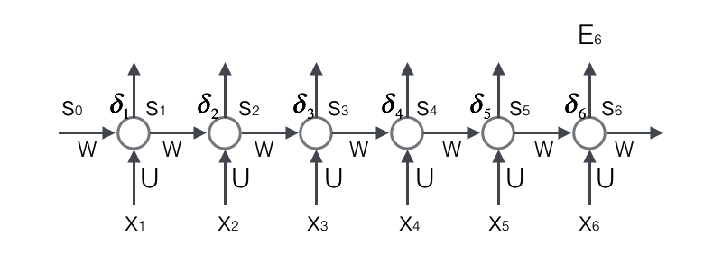
上图展示了我们到目前位置，在前两步中已经计算得到的量，包括每个时刻t循环层的输出值$s_{t}$，以及误差项$\delta_{t}$。在全链接网络的权重梯度计算算法是，只要知道任意一个时刻的误差项$\delta_{t}$，以及上一时刻循环层的输出值$s_{t-1}$，就可以按照下面的公式求出权重矩阵在t时刻的梯度$\Delta w_{t}E$
$$ \Delta w_{t}E =
\begin{bmatrix}
\delta_{1}^{t}s_{1}^{t-1} & \delta_{1}^{t}s_{2}^{t-1} & ... & \delta_{1}^{t}s_{n}^{t-1} \\
\delta_{2}^{t}s_{1}^{t-1} & \delta_{2}^{t}s_{2}^{t-1} & ... & \delta_{2}^{t}s_{n}^{t-1} \\
& . & & & \\
& . & & & \\
\delta_{n}^{t}s_{1}^{t-1} & \delta_{n}^{t}s_{2}^{t-1} & ... & \delta_{n}^{t}s_{n}^{t-1} \end{bmatrix}
$$
在式中，$\delta_{i}^{t}$表示t时刻误差项向量的第i个分量，$s_{i}^{t-1}$表示时刻t-1时刻循环层第i个神经元第输出值。上面的公式推导有：
我们知道
$$ net_{t} = Ux_{t} + Ws_{t-1} $$
$$
\begin{bmatrix}
net_{1}^{t} \\
net_{2}^{t} \\
.\\
.\\
net_{b}^{t}\end{bmatrix} =
Ux_{t} +
\begin{bmatrix}
\omega_{11} & \omega_{12} & ... & \omega_{1n}\\
\omega_{21} & \omega_{22} & ... & \omega_{2n}\\
.\\
.\\
\omega_{n1} & omega_{n2} & ... & \omega_{nn}\end{bmatrix}
\begin{bmatrix}
s_{1}^{t-1}\\
s_{2}^{t-1}\\
.\\
.\\
s_{n}^{t-1}\end{bmatrix}
$$
$$ = Ux_{t} +
\begin{bmatrix}
\omega_{11}s_{1}^{t-1} + \omega_{12}s_{2}^{t-1} & ... & \omega_{1n}s_{n}^{t-1} \\
\omega_{21}s_{1}^{t-1} + \omega_{22}s_{2}^{t-1} & ... & \omega_{2n}s_{n}^{t-1}\\
. & & \\
. & & \\
\omega_{n1}s_{1}^{t-1} + \omega_{n2}s_{2}^{t-1} & ... & \omega_{nn}s_{n}^{t-1}\end{bmatrix}
$$
因为对W求导与$Ux_{t}$无关所以不用考虑。考虑权重项$\omega_{ji}$求导。通过观察上式可以知道$\omega_{ji}$只与$net_{j}^{t}$有关。
$$ \frac{\partial E}{\partial \omega_{ji}} = \frac{\partial E}{\partial net_{j}^{t}} \frac{\partial net_{j}^{t}}{\partial \omega_{ji}}$$
$$ = \delta_{j}^{t}s_{i}^{t-1} $$
按照上面对规律就可以生成公式5的矩阵。
我们已经求得了权重矩阵W在t时刻得梯度$\Delta w_{t}E$，最终得梯度$\Delta wE$是各个时刻得梯度之和：
$$ \Delta wE = \sum_{i=1}^{t}\Delta w_{i}E $$

$$
= \begin{bmatrix}
\delta_{1}^{t}s_{1}^{t-1} & \delta_{1}^{t}s_{2}^{t-1} & ... & \delta_{1}^{t}s_{n}^{t-1}\\
\delta_{2}^{t}s_{1}^{t-1} & \delta_{2}^{t}s_{2}^{t-1} & ... & \delta_{2}^{t}s_{n}^{t-1}\\
.\\
.\\
\delta_{n}^{t}s_{1}^{t-1} & \delta_{n}^{t}s_{2}^{t-1} & ... & \delta_{n}^{t}s_{n}^{t-1}\\
\end{bmatrix} + ... +
\begin{bmatrix}
\delta_{1}^{1}s_{1}^{0} & \delta_{1}^{1}s_{2}^{0} & ... & \delta_{1}^{1}s_{n}^{0}\\
\delta_{2}^{1}s_{1}^{0} & \delta_{2}^{1}s_{2}^{0} & ... & \delta_{2}^{1}s_{n}^{0}\\
.\\
.\\
\delta_{n}^{1}x_{1}^{0} & \delta_{n}^{1}x_{2}^{0} & ... & \delta_{n}^{1}x_{n}^{0}\\
\end{bmatrix}
$$
公式6
上面是计算循环层权重矩阵w的梯度的公式。
下面将是解释各个时刻的梯度之和是来计算最终梯度的过程。其中用到了矩阵对矩阵求导、张量与向量想成预算的一些法则。
$$ net_{t}=Ux_{t}+Wf(net_{t-1}) $$
其中$Ux_{t}$与w完全无关，我们把它看作敞亮。现在，考虑第一个式子加号右边的部分，因为w和$f(net_{t-1})$都是w的函数，导数相乘法则
$$ {(uv)}'={u}'v+u{v}' $$
上面第一个式子写成：
$$ \frac{\partial net_{t}}{\partial W}=\frac{\partial W}{\partial W}f(net_{t-1})+W\frac{\partial f(net_{t-1})}{\partial W} $$
有：
$$ \Delta wE = \frac{\partial E}{\partial W} $$
$$ =\frac{\partial E}{\partial net_{t}} \frac{\partial net_{t}}{\partial W} $$
$$ =\delta_{t}^{T}\frac{\partial W}{\partial W}f(net_{t-1})+\delta_{t}^{T}w\frac{\partial f(net_{t-1})}{\partial W} $$
公式7
先算公式左边部分。

$$ \frac{\partial w}{\partial W} =
\begin{bmatrix}
\frac{\partial w_{11}}{\partial W} & \frac{\partial w_{12}}{\partial W} & ... & \frac{\partial w_{1n}}{\partial W} \\
\frac{\partial w_{21}}{\partial W} & \frac{\partial w_{22}}{\partial W} & ... & \frac{\partial w_{2n}}{\partial W} \\
.\\
.\\
\frac{\partial w_{n1}}{\partial W} & \frac{\partial w_{n2}}{\partial W} & ... & \frac{\partial w_{nn}}{\partial W}
\end{bmatrix}
$$
$$ =
\begin{bmatrix}
	\begin{bmatrix}
	\frac{\partial w_{11}}{\partial w_{11}} & \frac{\partial w_{11}}{\partial w_{12}} & ... & \frac{\partial w_{11}}{\partial w_{1n}} \\
	\frac{\partial w_{11}}{\partial w_{21}} & \frac{\partial w_{11}}{\partial w_{22}} & ... & \frac{\partial w_{11}}{\partial w_{2n}} \\
	.\\
	.\\
	\frac{\partial w_{11}}{\partial w_{n1}} & \frac{\partial w_{11}}{\partial w_{n2}} & ... & \frac{\partial w_{11}}{\partial w_{nn}}
	\end{bmatrix}
	&
	\begin{bmatrix}
	\frac{\partial w_{12}}{\partial w_{11}} & \frac{\partial w_{12}}{\partial w_{12}} & ... & \frac{\partial w_{12}}{\partial w_{1n}} \\
	\frac{\partial w_{12}}{\partial w_{21}} & \frac{\partial w_{12}}{\partial w_{22}} & ... & \frac{\partial w_{12}}{\partial w_{2n}} \\
	.\\
	.\\
	\frac{\partial w_{12}}{\partial w_{n1}} & \frac{\partial w_{12}}{\partial w_{n2}} & ... & \frac{\partial w_{12}}{\partial w_{nn}}
	\end{bmatrix}
	& ...\\
	.\\
	.
\end{bmatrix}
$$

$$
= \begin{bmatrix}
	\begin{bmatrix}
	1 & 0 & ... & 0 \\
	0 & 0 & ... & 0 \\
	.\\
	.\\
	0 & 0 & ... 0
	\end{bmatrix}
	&
	\begin{bmatrix}
	0 & 1 & ... & 0 \\
	0 & 0 & ... & 0 \\
	.\\
	.\\
	0 & 0 & ... 0
	\end{bmatrix}
	& ... \\
	. \\
	.
\end{bmatrix}
$$
$s_{t-1}=f(net_{t-1})$，它是一个列向量。上面向量与这个向量做积，得到三维张量，再左乘行向量$\delta_{t}^{T}$，最终得到一个矩阵：
$$ \delta_{t}^{T}f(net_{t-1})=\delta_{t}^{T}\frac{\partial W}{\partial W}s_{t-1} $$
$$
= \delta_{t}^{T}
\begin{bmatrix}
	\begin{bmatrix}
	1 & 0 & ... & 0 \\
	0 & 0 & ... & 0 \\
	.\\
	.\\
	0 & 0 & ... 0
	\end{bmatrix}
	&
	\begin{bmatrix}
	0 & 1 & ... & 0 \\
	0 & 0 & ... & 0 \\
	.\\
	.\\
	0 & 0 & ... 0
	\end{bmatrix}
	& ... \\
	. \\
	.
\end{bmatrix}
\begin{bmatrix}
	s_{1}^{t-1}\\
	s_{2}^{t-1}\\
	.\\
	.\\
	s_{n}^{t-1}
\end{bmatrix}
$$
$$
=\delta_{t}^{T}
\begin{bmatrix}
	\begin{bmatrix}
	s_{1}^{t-1}\\
	0 \\
	.\\
	.\\
	0
	\end{bmatrix}
	&
	\begin{bmatrix}
	s_{2}^{t-1} \\
	0 \\
	.\\
	.\\
	0
	\end{bmatrix}
	& ... \\
	. \\
	.
\end{bmatrix}
$$
$$
= \begin{bmatrix}
\delta_{1}^{t} & \delta_{2}^{t} & ... & \delta_{n}^{t}
\end{bmatrix}
\begin{bmatrix}
	\begin{bmatrix}
	s_{1}^{t-1}\\
	0 \\
	.\\
	.\\
	0
	\end{bmatrix}
	&
	\begin{bmatrix}
	s_{2}^{t-1} \\
	0 \\
	.\\
	.\\
	0
	\end{bmatrix}
	& ... \\
	. \\
	.
\end{bmatrix} $$

$$ =
\begin{bmatrix}
\delta_{1}^{t}s_{1}^{t-1} & \delta_{1}^{t}s_{2}^{t-1} & ... & \delta_{1}^{t}s_{n}^{t-1} \\
\delta_{2}^{t}s_{1}^{t-1} & \delta_{2}^{t}s_{2}^{t-1} & ... & \delta_{2}^{t}s_{n}^{t-1} \\
.\\
.\\
\delta_{n}^{t}s_{1}^{t-1} & \delta_{n}^{t}s_{2}^{t-1} & ... & \delta_{n}^{t}s_{n}^{t-1}
\end{bmatrix}
$$
$$ =
\Delta w_{t}E
$$
然后是公式加号的右边：
$$ \delta_{t}^{T}W\frac{\partial f(net_{t-1})}{\partial W}=\delta_{t}^{T}W\frac{\partial f(net_{t-1})}{\partial net_{t-1}}\frac{\partial net_{t-1}}{\partial W} $$
$$ =\delta_{t}^{T}W{f}'(net_{t-1})\frac{\partial net_{t-1}}{\partial W} $$
$$ =\delta_{t}^{T}\frac{\partial net_{t}}{\partial net_{t-1}}\frac{\partial net_{t-1}}{\partial W} $$
$$ =\delta_{t-1}^{T}\frac{\partial net_{t-1}}{\partial W} $$

于是：
$$ \Delta wE= \frac{\partial E}{\partial W} $$

$$ =\frac{\partial E}{\partial net_{t}}\frac{\partial net_{t}}{\partial W} $$
$$ =\Delta w_{t}E + \delta_{t-1}^{T}\frac{\partial net_{t-1}}{\partial W} $$
$$ =\Delta w_{t}E + \Delta w_{t-1}E + \delta_{t-2}^{T}\frac{\partial net_t-2}{\partial W} $$
$$ = \Delta w_{t}E + \Delta w_{t-1}E + ... + \Delta w_{1}E $$
$$ =\sum_{k=1}^{t}\Delta w_{k}E $$
最后的梯度$\Delta wE$是梯度总和。
权重矩阵W在t时刻的梯度$\Delta w_{t}E$，最终的梯度$\Delta wE$是各个时刻的梯度只和：
$$
\Delta U_{t}E = \begin{bmatrix}
\delta_{1}^{t}x_{1}^{t} & \delta_{1}^{t}x_{2}^{t} & ... & \delta_{1}^{t}x_{m}^{t}\\
\delta_{2}^{t}x_{1}^{t} & \delta_{2}^{t}x_{2}^{t} & ... & \delta_{2}^{t}x_{m}^{t}\\
.\\
.\\
\delta_{n}^{t}x_{1}^{t} & \delta_{n}^{t}x_{2}^{t} & ... & \delta_{n}^{t}x_{m}^{t}\\
\end{bmatrix}
$$

公式8
公式8是误差函数在t时刻对权重矩阵U的梯度。和权重矩阵W一样，最终的梯度也是各个时刻的梯度之和：
$$ \Delta_{U}E = \sum_{i=1}^{t}\Delta_{U_{i}}E $$


##### RNN梯度消失原因：
RNN不太适合处理较长序列的原因是RNN在训练过程中会很容易发生梯度爆炸和梯度消失，这导致训练时梯度不能在较长序列中一直传递下去，从而使得RNN无法捕捉到长距离的影响。RNN会产生梯度爆炸和消失的问题是如何产生的？根据公式3可得:
$$ \delta_{k}^{T}=\delta_{t}^{T}\prod_{i=k}^{t-1} w diag[{f}'(net_{i})] $$
$$ \left \| \delta_{k}^{T} \right \| \leq \left \| \delta_{t}^{T} \right \| \prod_{i=k}^{t-1}\left \| W \right \| \left \| diag[{f}'(net_{i})] \right\| $$
$$ \leq \left \| \delta_{t}^{T} \right \|(\beta_{w}\beta_{f})^{t-k} $$
上面的$\beta$定义为矩阵的模的上界。因为上式是一个指数函数，如果t-k很大的话(向前很多个时刻的时候)，会导致对应的误差项的值增长或缩小的非常快，这样就会导致相应的梯度爆炸和梯度消失问题，主要取决于$\beta$大于1还是小于1。
通常来说，梯度爆炸更容易处理。因为梯度爆炸的时候，我们的程序会收到NaN错误。我们也可以设置一个梯度阈值，当梯度超过这个阈值的时候可以直接截取。
但是梯度消失就比较难检测，而且也更难处理。下面是三种对梯度消失问题对处理方法：
	1.处理对初始化权重值。初始化权重，使每个神经元尽可能不要取极大值，以躲开梯度消失对区域。
	2.使用relu替代sigmoid和tanh作为激活函数。
  	3.使用其他网络结构，长短记忆网络 LSTM和GRU
#### 向量化
神经网络对输入和输出都是向量，为了让语言模型能够被神经网络处理必须吧词表达为向量形式对，这样神经网络才能处理它。神经网络的输入是词，我们可以用下面步骤对输入进行向量化：
1.建立以个包含所有词的词典，每个词在词典里面又一个唯一的编号。
2.任意一个词都有可以用一个N纬的one-hot向量来表示。其中，N是词典中包含的词的个数。假设一个词在词典中的编号是i，v是表示这个词的向量，$v_{j}$是向量的第j个元素，则：
$$ v_{j} = \begin{cases}
1 & \text j = i \\
0 & \text j \neq i
\end{cases} $$
使用这种向量化的方法，我们就得到了以个高纬，稀疏的向量(稀疏是指绝大部分元素的值都是0)。处理这样的向量会导致我们的神经网络有很多的参数，带来庞大的计算量。因此，往往会需要使用一些降纬方法，将高纬度稀疏向量转变为低纬度稠密向量。语言模型要求的输出是下一个最可能的词，我们可以让循环神经网络计算计算词典中每个词是下一个词的概率，这样概率最大的词就是下一个最可能的词。因此，神经网络的输出向量也是一个N纬向量，向量中的每个元素对应着词典中相应的词是下一个词的概率。

### Softmax层
语言模型是对下一个词出现对概率进行建模。那么，怎样让神经网络输出概率呢？方法就是用softmax层作为神经网络对输出层。softmax的定义：
$$ g(z_{i})=\frac{e^{z_{i}}}{\sum_{k}e^{z_{k}}} $$
具体描述如下图所示:
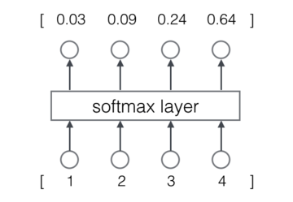
从上图我们可以看到，softmax层的输入是一个向量，输出也是一个向量，两个向量的维度是一样的(在图中是4)。输入向量x=[1 2 3 4]经过softmax层之后，经过上面公式计算，转变为输出向量y=[0.03 0.09 0.24 0.64]计算过程：
$$ y_{1}=\frac{e^{x_{1}}}{\sum_{k}e^{x_{k}}} $$
$$ =\frac{e^{1}}{e^{1} + e^{2} + e^{3} + e^{4}} $$
$$ =0.03 $$
$$ y_{2}=\frac{e^{2}}{e^{1} + e^{2} + e^{3} + e^{4}} $$
$$ =0.09 $$
$$ y_{3} = \frac{e^{3}}{e^{1} + e^{2} + e^{3} + e^{4}} $$
$$ =0.24 $$
$$ y_{4}=\frac{e^{4}}{e^{1} + e^{2} + e^{3} + e^{4}} $$
$$ =0.64 $$
那么输出向量y的特征：
- 1.每一项为取值为0-1之间的正数；
- 2.所有项的总和是1.
不难发现，这些特征和概率的特征是一样的，因此为们可以把他们看作是概率。对于语言模型来说，我们可以认为模型预测下一个词是词典中第一个词的概率是0.03，是词典中第二个词的概率是0.09，以此类推。
### 交叉熵误差
一般来说，当神经网络的输出层是softmax层时，对应的误差函数E通常选择交叉误差函数，其定义如下：
$$ L(y,o) = -\frac{1}{N}\sum_{n\in N}y_{n}\log o_{n}$$
在上式中国呢，N是训练样本的个数，向量$y_{n}$是样本的标记，向量$o_{n}$是网络的输出。标记$y_{n}$是一个one-hot向量,例如$y_{1}=[1,0,0,0]$，如果网络的输出o=[0.03,0.09,0.24,0.64]，那么，交叉熵误差(假设只有一个训练样本，即N=1)
$$ L=-\frac{1}{N}\sum_{n\in N}y_{n}\log o_{n} $$
$$ =-y_{1}\log o_{1} $$
$$ =-(1 * \log 0.03 + 0 * \log 0.09 + 0 * \log 0.24 + 0 * \log 0.64) $$
$$ =3.51 $$
我们当然可以选择其他函数作为为们的误差函数，比如最小平方误差函数(MSE)。不过对概率进行建模时候，选择交叉熵误差函数更make sense。
```python
import numpy as np
form cnn
```
- RNN的结构如下所示
- 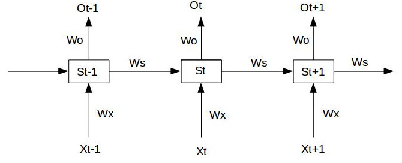
- 用时间序列只有三段的情况下，$ S_{0} $ 为给定的值，神经元没有激活函数，则RNN最简单的向前传播过程如下:

  - $ S_{1} = W_{x}X_{1} + W_{s}S_{0} + b_{1} $ $ O_{1} = W_{o}S_{1}k + b_{2} $
  - $ S_{2} = W_{x}X_{2} + W_{s}S_{1} + b_{1} $ $ O_{2} = W_{o}S_{2}k + b_{2} $
  - $ S_{3} = W_{x}X_{3} + W_{s}S_{2} + b_{1} $ $ O_{3} = W_{o}S_{3}k + b_{2} $

假设在t=3时刻，损失函数为 $ L_{3}= \frac{1}{2}(Y_{3} - O_{3}^{2}) $ 则对于一次训练人物的损失函数为$ L_{3}=\sum_{t=0}^{T}L_{t} $,即每一时刻损失值的累加。 使用随机梯度下降训练RNN其实就是对$W_{x}$、$W_{s}$、$W_{o}$以及b_{1}b_{2}求偏导，并不断调整以使L尽可能达到最小对过程。 现在假设在我们对时间序列只有三段，t1,t2,t3。 我们支队t3时刻对$W_{x}$ $W_{S}$ $W_{0}$

- 求偏导:

  - $ \frac{\partial L_{3}}{\partial W_{0}} = \frac{\partial L_{3}}{\partial O_{3}} \frac{\partial O_{3}}{\partial W_{o}}$
  - $ \frac{\partial L_{3}}{\partial W_{x}} = \frac{\partial L_{3}}{\partial O_{3}} \frac{\partial O_{3}}{\partial S_{3}} \frac{\partial S_{3}}{\partial W_{x}} + \frac{\partial L_{3}}{\partial O_{3}} \frac{\partial O_{3}}{\partial S_{3}} \frac{\partial S_{3}}{\partial S_{2}} \frac{\partial S_{2}}{\partial W_{x}} +$

# LSTM
上面对部分讲了RNN循环网络。也介绍了循环神经网络很难训练的原因，这导致了它在实际应用中，很难处理长距离的依赖。在文中介绍的是RNN的改进升级版本：长短记忆网络(Long Short Term Memory Network,LSTM)，它成功的解决了原始循环神经网络的缺陷，成为当前最流行的RNN，在语音识别、图像描述、自然语言处理等许多领域中成功应用。但不幸但一面是，LSTM的结构很复杂。在LSTM之后还有一种LSTM的变体，GRU(Gated Recurrent Unit)。结构比LSTM简单，而效果却和LSTM一样好，因此，它正在逐渐流行起来。
在循环神经网络中推到的误差项沿时间反向传播：
$$ \delta_{k}^{T} =\delta_{t}^{T} \prod_{i=k}^{t-1}diag[{f}'(net_{i})]W $$
我们可以根据下面的不等式，来获取$\delta_{k}^{T}$模的上街(模可以看作对$\delta_{k}^{T}$中每一项值大小的度量)：
$$ \left\|\delta_{k}^{T} \right \|  \leq \left\| \delta_{t}^{T} \right\| \prod_{i=k}^{t-1}\left\| diag[{f}'(net_{i})] \right\| \left\| W \right\| $$
$$ \leq \left\| \delta_{t}^{T} \right\| (\beta_{f}\beta_{W})^{t-k} $$
误差项$\delta$从t时刻传递到k时刻，其值的上街是$\beta_{f}\beta_{w}$的指数函数。$\beta_{f}^{w}$分别是对角矩阵$diag[{f}'(net_{i})]$
和矩阵W模的上界。显然，除非$\beta_{f}\beta_{w}$乘积的值位于1附近，否则，当t-k很大时(就是误差传递很多歌时刻时)，整个式子的值就会变得极小(当$\beta_{f}\beta_{w}$乘积小于1)或者极大(当$\beta_{f}\beta_{w}$乘积大于1)，前者就是梯度消失，后者就是梯度爆炸。虽然有一些技巧可以适当阻止这种情况(比如怎样初始化权重),让$\beta_{f}\beta^{w}$的值尽可能贴近于1，终究还是难以抵挡指数的威力。
数组W最终的梯度是各个时刻的梯度之和，即：
$$ \Delta_{W}E = \sum_{t}^{k=1}\Delta_{Wk}E $$
$$ = \Delta_{Wk}E + \Delta_{Wt-1}E +\Delta_{Wt-2}E + ... + \Delta_{W1}E $$
假设某一轮训练的时候各时刻梯度以及最终的梯度之和如下图:
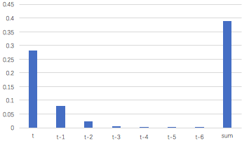
可以看到上面图中t-3时刻开始，梯度已经几乎减少到0了。那么从这个时刻开始在往前走，得到到梯度几乎为零就不会对最终的梯度值有任何贡献，这就相当于无论t-3时刻之前的网络状态h是什么，在训练中都不会对权重数组W的更新产生影响。也就是网络事实上已经忽略了t-3时刻之前的状态。这就是原始RNN无法处理长距离依赖的原因。其中长短记忆网络的思路是原始RNN的隐藏层只有一个状态，即h，它对于短期的输入非常敏感。那么，假如我们在增加一个状态，即c，让它来保存长期的状态，那么问题就解决了。
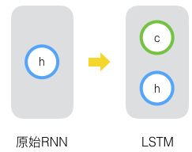
新增加的状态c，称为单元状态(cell state)。吧上图按照时间维度展开:
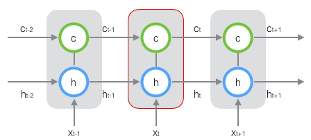
上面图是一种示意图，在t时刻LSTM对输入有三个：当前时刻网络的输入值$X_{t}$、上一时刻LSTM的输出值$h_{t-1}$、以及上一时刻的单元状态$c_{t-1}$；LSTM的输出有两个：当前时刻LSTM输出值$h_{t}$和当前时刻的单元状态$c_{t}$。当前的x、h、c是向量。
LSTM的关键，就是怎样控制长期状态c。LSTM的思路是使用三个控制开关。第一个开关，负责控制继续保存长期状态c；第二个开关，负责控制把即时状态输入到长期状态c；第三个开关，负责控制是否把长期状态c作为当前LSTM的输出。
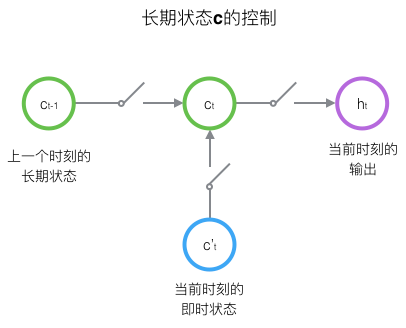
输出h和单元状态c的具体计算方法：
长短记忆网络的向前计算
前面描述的开关是怎样实现的呢？这就用到了门(gate)到概念。门实际上就是一层全链接层，它到输入是一个向量，输出是一个0到1之间到实数向量。假设W是门的权重向量，b是偏置项，那么门就可以表示为：
$$ g(x)=\sigma(Wx+b) $$
门的使用就是用门的输出向量按元素乘以为门需要控制的那个向量。因为门的输出是0到1之间到实数向量，那么当门输出为0时，任何向量与之想成都会得到0向量，这就相当于什么都不能通过；输出为1时，任何向量与之相乘都不会有任何改变，这就相当于什么都可以通过。因为$\sigma$(也就是sigmoid函数)的值域是(0,1)，所以门的状态都是半开半闭的。
LSTM用两个门来控单元状态c的内容，一个是遗忘门(forget gate)他决定了上一时刻的单元状态$c_{t-1}$有多少保留到当前时刻$c_{t}$另一个是输出门(input gate)他决定了当前时刻网络的输入$x_{t}$有多少保存到单元状态$c_{t}$。LSTM用输出门(output gate)来控制单元状态怒$c_{t}$有多少输出到LSTM的当前输出值$h_{t}$
先说一下遗忘门：
$$ f_{t}=\sigma (W_{f}\cdot[h_{t-1},x_{t}]+ b_{f}) $$
式子中，$W_{f}$是遗忘门的权重矩阵，$[h_{t-1},x_{t}]$表示把两个向量链接称一个更长的向量，$b_{f}$是遗忘门的偏置项，$\sigma$是sigmoid函数。如果输入的维度是$d_{x}$，输入层的维度是$d_{x}$，隐藏层的维度是$d_{h}$，单元状态的维度是$d_{c}$(通常$d_{c}=d_{h}$)。事实桑拿，权重矩阵$W_{f}$都是两个矩阵拼接而成的:一个是$W_{fh}$，它对应着输入项$h_{t-1}$，其维度为$d_{c} x d_{x}$。$ W_{f} $可以写为：
$$ [W_{f}]\begin{bmatrix}
h_{t-1}\\
x_{t}
\end{bmatrix}  = \begin{bmatrix} W_{fh} & W_{fx} \end{bmatrix} \begin{bmatrix}
h_{t-1}\\
x_{t}
\end{bmatrix}
$$
$$ = W_{fh}h_{t-1}+W_{fx}x_{t} $$
下图现实了遗忘门的计算:
 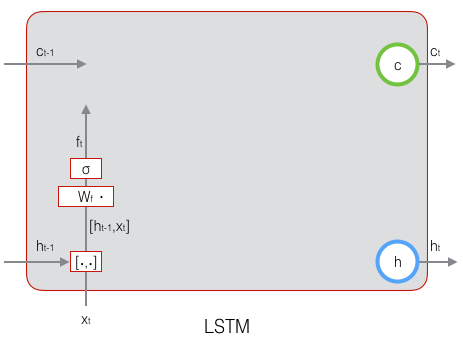
然后看一下输入门：
$$ i_{t}=\sigma(W_{i}\cdot[h_{t-1,x_{t}}]+ b_{i}) $$
从上面的式子看出 $W_{i}$是输入门的权重矩阵，$b_{i}$是输入门的偏置项。下图表示了输入门的计算：
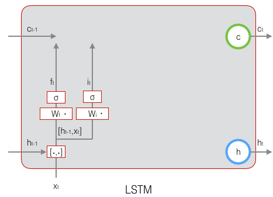
接下来，计算用于描述当前输入的单元状态$\widetilde{c}_{t}$，它是根据上一次的输出和本次的输入来计算的：
$$ \widetilde{c}_{t}=\tanh(W_{c}\cdot [h_{t-1},x_{t}]+b_{c}) $$
下图是$ \widetilde{c}_{t} $的计算:
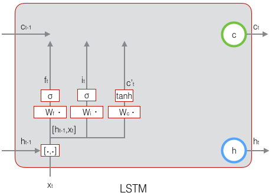
现在计算当前时刻单元状态$c_{t}$。它是由上一次当单元状态$c_{t-1}$按元素乘以遗忘门$f_{t}$再用当前输入当单元状态$\widetilde{c}_{t}$按元素乘以输入门$i_{t}$，再将两个积加和产生的：
$$ c_{t} = f_{t} \circ  c_{t-1} + i_{t} \circ  \widetilde{c}_{t}$$

符号$\circ$表示按元素相乘。下图是$c_{t}$的计算:
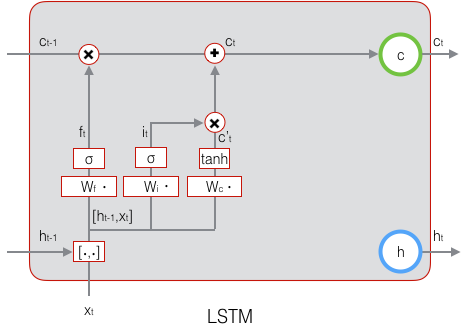
这样，我们就把LSTM关于当前的记忆$\widetilde{c}_{t}$和长期的记忆$c_{t-1}$组合在一起，形成了心的单元状态$c_{t}$。由于遗忘门的控制，它可以保存很久很久之前的信息，由于输入们的控制，它又可以避免当前无关紧要的内容进入记忆。下面看看输出门，它控制了长期记忆对当前输出的影响:
$$ o_{t}=\sigma(W_{o}\cdot[h_{t-1},x_{t}] + b_{o]}) $$
下面表示输出门的计算：
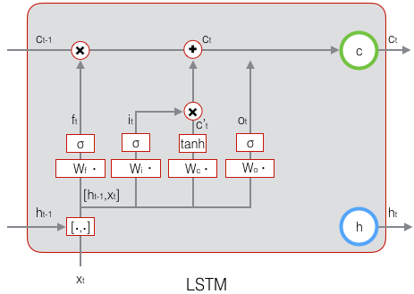
LSTM最终的输出，是由输出门和单元状态共同确定的：
$$ h_{t}=o_{t} \circ tanh (c_{t}) $$ 公式6
下图表示LSTM最终输出的计算:
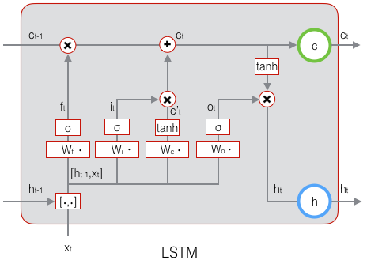
式1到式6就是LSTM前向计算的全部公式。
### 长短记忆网络的训练
训练部分往往比前向计算部分复杂多了。LSTM的前向计算都这么复杂，那么训练算法一定是非常非常复杂的。
#### LSTM训练算法框架
LSTM的训练算法仍然是反向传播算法，对于这个算法，主要有三个步骤：
- 1.向前计算每个神经元的输出值，对于LSTM来说，即$f_{t}$、$i_{t}$、$c_{t}$、$o_{t}$、$h_{t}$五个向量的值。
- 2.反向计算每个神经元的误差项$\delta$值。与新欢神经网络一样，LSTM误差项的反向传播也是包括两个方面：一个是沿时间的反向传播，即从当前t时刻开始，计算每个时刻的误差项；一个是将误差项向上一层传播。
- 3.根据相应的误差项，计算每个权重的梯度。
#### 关于公式和符号
设定gate的激活函数是sigmoid函数，输出的激活函数为tanh函数，输出的激活函数为tanh函数，他们的倒数分别为；
$$ \sigma(z)=y=\frac{1}{1+e^{-z}} $$
$$ {\sigma}'=y(1-y) $$
$$ tanh(z)=y=\frac{e^{z}-e^{-z}}{e^{z}+e^{-z}} $$
$$ {tanh}'(z)=1-y^{2} $$
从上面可以看出，sigmoid和tanh函数的倒数都是原函数的函数。这样，我们一旦计算原函数的值，就可以用它来计算出导数的值。LSTM需要学习的参数有8组，分别是：
- 1.遗忘门的权重矩阵$W_{f}$和偏执项$b_{f}$
- 2.输入门的权重矩阵$W_{i}$和偏执项$b_{i}$
- 3.输出门的权重矩阵$W_{o}$和偏执项$b_{o}$
- 4.设计单元状态的权重$W_{c}$和偏执项$b_{c}$
因为权重矩阵的两部分在反向传播中使用不同的公式，因此在后续的推导中，权重矩阵$W_{f}$、 $W_{i}$、$W_{c}$、$W_{o}$都将被写为分开的两个矩阵:$W_{fh}$、$W_{fx}$、$W_{ih}$、$W_{ix}$、$W_{oh}$、$W_{ox}$、$W_{ch}$、$W_{cx}$。
按元素乘$\circ$符号。当$\circ$作用于两个向量，如下:
$$
a \circ b=
\begin{bmatrix}
a_{1}\\
a_{2}\\
a_{3}\\
...\\
a_{n}
\end{bmatrix} \circ
\begin{bmatrix}
b_{1}\\
b_{2}\\
b_{3}\\
...\\
b_{n}
\end{bmatrix} =
\begin{bmatrix}
a_{1}b_{1}\\
a_{1}b_{2}\\
a_{1}b_{3}\\
...\\
a_{1}b_{n}
\end{bmatrix}
$$
当$\circ$作用于一个向量和一个助阵时，
$$
a \circ X=
\begin{bmatrix}
a_{1}\\
a_{2}\\
a_{3}\\
...\\
a_{n}
\end{bmatrix} \circ
\begin{bmatrix}
x_{11} & x_{12} & x_{13} & ... & x_{1n}\\
x_{21} & x_{22} & x_{23} & ... & x_{2n}\\
x_{31} & x_{32} & x_{33} & ... & x_{3n}\\
& & & ...\\
x_{n1} & x_{n2} & x_{n3} & ... & x_{nn}
\end{bmatrix} =
\begin{bmatrix}
a_{1}x_{11} & a_{1}x_{12} & a_{1}x_{13} & ... & a_{1}x_{1n}\\
a_{2}x_{21} & a_{2}x_{22} & a_{2}x_{23} & ... & a_{2}x_{2n}\\
a_{3}x_{31} & a_{3}x_{32} & a_{3}x_{33} & ... & a_{3}x_{3n}\\
& & & ...\\
a_{n}x_{n1} & a_{n}x_{n2} & a_{n}x_{n3} & ... & a_{n}x_{nn}
\end{bmatrix}
$$
当$\circ$作用于两个矩阵时，当两个矩阵对应位置的元素相乘。按元素乘可以在某些情况下简化矩阵和向量运算。例如，当一个对焦矩阵右乘一个矩阵时，相当于用对焦矩阵的对焦线组成的向量按元素乘那个矩阵： 
$$ diag[a]X = a\circ X $$
当一个行向量右乘一个对角矩阵时，详单于这个行向量按元素那乘那个矩阵对焦线组成当向量：
当一个行向量右乘一个对角矩阵时，相当于这个行向量按元素乘那个矩阵对角线组成的向量：
$$ a^{T}diag[b]=a \circ b $$
上面这两点，在后续推导中会多次用到。
在t时刻，LSTM的输出值为$h_{t}$。我们定义t时刻的误差项$\delta_{t}$为:
$$ \delta_{t}=^{def} \frac{\partial E}{\partial h_{t}} $$
注意，这里假设误差项是损失函数对输出值的导数，而不是加权输入$net_{t}^{l}$的导数。因为LSTM有四个加权输入，分别对应$f_{t}$、$i_{t}$、$c_{t}$、$o_{t}$，我们希望往上一层传递一个误差项而不是四个。但我们仍然需要定义处这四个加权输入，以及他们对应的误差项。
$$ net_{f,t} = W_{f}[h_{t-1},x_{t}]+b_{f} $$
$$ =W_{fh}h_{t-1}+W_{fx}x_{t}+b_{f} $$
$$ net_{i,t}=W_{i}[h_{t-1},x_{t}]+b_{i} $$
$$ =W_{ih}h_{t-1}+W_{ix}x_{t}+b_{i} $$
$$ net_{\overline{c},t}=W_{c}[h_{t-1},x_{t}] + b_{c} $$
$$ =W_{ch}h_{t-1} + W_{cx}x_{t}+ b_{c} $$
$$ net_{o,t} = W_{o}[h_{t-1},x_{t}] + b_{o} $$
$$ =W_{oh}h_{t-1} + W_{ox}x_{t}+b_{o} $$
$$ \delta_{f,t}=^{def}\frac{\partial E}{\partial net_{f,t}} $$
$$ \delta_{i,t}=^{def}\frac{\partial E}{\partial net_{i,t}} $$
$$ \delta_{\overline{c},t}=^{def}\frac{\partial E}{\partial net_{\overline{c},t}} $$
$$ \delta_{o,t}=^{def}=\frac{\partial E}{\partial net_{o,t}} $$
#### 误差项沿着时间反向传播
沿时间反向传递误差项，就是要计算处t-1时刻的误差项$\delta_{t-1}$。
$$ \delta_{t-1}^{T}=\frac{\partial E}{\partial h_{t-1}} $$
$$= \frac{\partial E}{\partial h_{t}}\frac{\partial h_{t}}{\partial h_{t-1}} $$
$$ \delta_{t}^{T}\frac{\partial h_{t}}{\partial h_{t-1}} $$
$\frac{h_{t}}{\partial h_{t-1}}$是一个Jacobian矩阵。如果隐藏层h的维度是N的话，那么它就是一个N X N矩阵。为了求出它，我们列出$h_{t}$的计算公式：
$$ h_{t}=o_{t}\circ tanh(c_{t}) $$
$$ c_{t}=f_{t}\circ c_{t-1} + i_{t} \circ \overline{c}_{t} $$
$o_{t}$、$f_{t}$、$i_{t}$、$\overline{c}_{t}$ 都是$h_{t-1}$的函数，那么，利用全导数公式可得：
$$
 \delta_{t}^{T}\frac{\partial h_{t}}{\partial h_{t-1}}=\delta_{t}^{T}\frac{\partial h_{t}}{\partial o_{t}}\frac{\partial o_{t}}{\partial net_{o,t}}\frac{\partial net_{o,t}}{\partial h_{t-1}} + \delta_{t}^{T}\frac{\partial h_{t}}{\partial c_{t}}\frac{\partial c_{t}}{\partial f_{t}}\frac{\partial f_{t}}{\partial net_{f,t}}\frac{\partial net_{f,t}}{\partial h_{t-1}} + \delta_{t}^{T}\frac{\partial h_{t}}{\partial c_{t}}\frac{\partial c_{t}}{\partial i_{t}} \frac{\partial i_{t}}{\partial net_{i,t}}\frac{\partial net_{i,t}}{\partial h_{t-1}}+\delta_{t}^{T}\frac{\partial h_{t}}{\partial c_{t}}\frac{\partial c_{t}}{\partial \overline{c}_{t}}\frac{\partial\overline{c}_{t}}{\partial net_{\overline{c},t}}\frac{\partial net_{\overline{c},t}}{\partial h_{t-1}}
$$
$$
=\delta_{o,t}^{T}\frac{\partial net_{o,t}}{\partial h_{t-1}}+\delta_{f,t}^{T}\frac{\partial net_{f,t}}{\partial h_{t-1}}+\delta_{i,t}^{T}\frac{\partial net_{i,t}}{\partial h_{t-1}} + \delta_{\overline{c},t}^{T}\frac{\partial  net_{\overline{c},t}}{\partial h_{t-1}}
$$
公式7
把上面公式中的每个偏导数求出来，根据公式6我们可以求出：
$$ \frac{\partial h_{t}}{\partial o_{t}}=diag[tanh(c_{t})] $$
$$ \frac{\partial h_{t}}{\partial c_{t}}=diag[o_{t}\circ (1-tanh(c_{t})^{2})] $$
$$ \frac{\partial c_{t}}{\partial f_{t}}=diag[c_{t-1}] $$
$$ \frac{\partial c_{t}}{\partial i_{t}}=diag[\overline{c}_{t}] $$
$$ \frac{\partial c_{t}}{\partial \overline{c}_{t}}=diag[i_{t}] $$
因为:
$$ o^{t}=\sigma(net_{o,t}) $$
$$ net_{o,t}=W_{oh}h_{t-1}+W_{ox}x_{t}+b_{o} $$
$$ f_{t}=\sigma(net_{f,t}) $$
$$ net_{f,t}=W_{fh}h_{t-1}+W_{fx}x_{t}+g_{f} $$
$$ i_{t}=\sigma(net_{i,t}) $$
$$ net_{i,t}=W_{ih}h_{t-1}+W_{ix}+b_{i} $$
$$ \overline{c}_{t}=tanh(net_{\overline{c},t}) $$
$$ net_{\overline{c},t}=W_{ch}h_{t-1}+W_{cx}x_{t}+b_{c} $$
可以得到:
$$ \frac{\partial o_{t}}{\partial net_{o,t}}=diag[o_{t}\circ (1-o_{t})] $$
$$ \frac{\partial net_{o,t}}{\partial h_{t-1}}=W_{oh} $$
$$ \frac{\partial f_{t}}{\partial net_{f,t}}=diag[f_{t}\circ (1-f_{t})] $$
$$ \frac{\partial net_{f,t}}{\partial h_{t-1}}=W_{fh} $$
$$ \frac{\partial i_{t}}{\partial net_{i,t}}=diag[i_{t}\circ (1-f_{t})] $$
$$ \frac{\partial net_{i,t}}{\partial h_{t-1}}=W_{ih} $$
$$ \frac{\partial net_{\overline{c},t}}{\partial h_{t-1}}=diag[i_{t}\circ (1-\overline{c}_{t}^{2})] $$
$$ \frac{\partial net_{\overline{c},t}}{\partial h_{t-1}}=W_{ch} $$
将上面偏导数倒入式子7，
$$ \delta_{t-1}=\delta_{o,t}^{T}\frac{\partial net_{o,t}}{\partial h_{t-1}}+\delta_{f,t}^{T}\frac{\partial net_{f,t}}{\partial h_{t-1}}+\delta_{i,t}^{T}\frac{\partial net_{i,t}}{\partial h_{t-1}}+\delta_{\overline{c},t}^{T}\frac{\partial net_{\overline{c},t}}{\partial h_{t-1}} $$
$$ =\delta_{o,t}^{T}W_{o,t}+\delta_{f,t}^{T}W_{fh}+\delta_{i,t}^{T}W_{ih}+\delta_{\overline{c},t}^{T}W_{ch} $$
公式8
根据$\delta_{o,t}$、$\delta_{f,t}$、$\delta_{i,t}$、$\delta_{\overline{c},t}$的定义，可知:
$$ \delta_{o,t}^{T}=\delta_{t}^{T}\circ tanh(c_{t})\circ o_{t}\circ(1-o_{t}) $$   公式9
$$ \delta_{f,t}^{T}=\delta_{t}^{T}\circ o_{t}\circ (1-tanh(c_{t})^{2})\circ c_{t-1}\circ f_{t}\circ (1-f_{t}) $$
$$ \delta_{i,t}^{T}=\delta_{t}^{T}\circ o_{t}\circ (1-tanh(c_{t})^{2})\circ \overline{c}_{t}\circ i_{t}\circ (1-i_{t}) $$
$$ \delta_{\overline{c},t}^{T}=\delta_{t}^{T}\circ o_{t}\circ (1-tanh(c_{t})^{2})\circ i_{t}\circ (1-\overline{c}^{2})  $$
上面的式子就是将误差愿时间反向传播一个时刻的公式。可以写出将误差项向前传递到任意k时刻的公式：
$$ \delta_{k}^{T}=\prod_{j=k}^{t-1}\delta_{o,j}^{T}W_{oh}+\delta_{T}^{f,j}W_{fh}+\delta_{f,j}^{T}W_{fh}+\delta_{i,j}^{T}W_{ih}+\delta_{\overline{c},j}^{T}W_{ch} $$
式13
将误差传递到上一层，定义上一层误差项是误差函数对上一层加权输入的导数，l表示当前层
$$ \delta_{t}^{l-1}=^{def}\frac{\partial E}{net_{t}^{l-1}} $$
LSTM输入$x_{t}$由下面公式计算:
$$ x_{l}^{t}=f^{l-1}(net_{t}^{l-1}) $$
$f_{l-1}$表示上一层的激活函数。
因为$net_{f,t}^{l}$、$net_{i,t}^{l}$、$net_{\overline{c}}^{l}$、$net_{o,t}^{l}$都是$x_{t}$的函数，$x_{t}$又是$net_{t}^{l-1}$的函数，因此，求出E对$net_{t}^{l-1}$的导数，就需要使用全导数公式：
$$ \frac{\partial E}{\partial net_{t}^{l-1}}=\frac{\partial E}{\partial net_{f,t}^{l}}\frac{\partial net_{f,t}^{l}}{\partial x_{t}^{l}}\frac{\partial x_{t}^{l}}{\partial net_{t}^{l-1}}+\frac{\partial E}{\partial net_{i,t}^{l}}\frac{\partial net_{i,t}^{l}}{\partial x_{t}^{l}}\frac{\partial x_{t}^{l}}{\partial net_{t}^{l-1}}+\frac{\partial E}{\partial net_{\overline{c},t}^{l}}\frac{\partial net_{\overline{c},t}^{l}}{\partial x_{t}^{l}}\frac{\partial x_{t}^{l}}{\partial net_{t}^{l-1}}+\frac{\partial E}{\partial net_{o,t}^{l}}\frac{\partial net_{l}^{o,t}}{\partial x_{t}^{l}}\frac{\partial x_{t}^{l}}{\partial net_{l-1}^{t}} $$
$$ =\delta_{T}^{f,t}W_{fx}\circ {f}'(net_{t}^{l-1})+\delta_{T}^{i,t}W_{ix}\circ {f}'(net_{t}^{l-1})+\delta_{T}^{\overline{c},t}W_{\overline{c}x}\circ {f}'(net_{t}^{l-1})+\delta_{T}^{o,t}W_{ox}\circ {f}'(net_{t}^{l-1}) $$
$$ =(\delta_{f,t}^{T})W_{fx}+\delta_{i,t}^{T})W_{ix}+\delta_{\overline{c},t}^{T})W_{cx}+\delta_{o,t}^{T})W_{ox}\circ {f}'(net_{t}^{l-1}) $$
公式14
是将误差传递到上一层到公式。
#### 权重梯度到计算
对于$W_{fh}$、$W_{ih}$、$W_{ch}$、$W_{oh}$的权重梯度，我们知道他的梯度是各个时刻梯度之和。首先要求出t时刻的梯度，然后再求出他们最终的梯度。
通过误差项$\delta_{o,t}$、$\delta_{f,t}$、$\delta_{i,t}$、$\delta_{\overline{c},t}$求得t时刻的$W_{oh}$、$W_{ih}$、$W_{fh}$、$W_{ch}$
$$ \frac{\partial E}{\partial W_{oh,t}}=\frac{\partial E}{\partial net_{o,t}}\frac{\partial net_{o,t}}{\partial W_{oh,t}} $$
$$ =\delta_{o,t}h_{t-1}^{T} $$
$$ \frac{\partial E}{\partial W_{fh,t}}=\frac{\partial E}{\partial net_{f,t}}\frac{\partial net_{f,t}}{\partial W_{fh,t}} $$
$$ =\delta_{f,t}h_{t-1}^{T} $$
$$ \frac{\partial E}{\partial W_{ih,t}}=\frac{\partial E}{\partial net_{i,t}}\frac{\partial net_{i,t}}{\partial W_{ih,t}} $$
$$ =\delta_{i,t}h_{t-1}^{T} $$
$$ \frac{\partial E}{\partial W_{ch,t}}=\frac{\partial E}{\partial net_{c,t}}\frac{\partial net_{c,t}}{\partial W_{fh,t}} $$
$$ =\delta_{c,t}h_{t-1}^{T} $$
再求出梯度的总和，就得到了最终的梯度：
$$ \frac{\partial E}{\partial W_{oh}}=\sum_{j=1}^{t}\delta_{o,j}h_{j-1}^{T} $$
$$ \frac{\partial E}{\partial W_{fh}}=\sum_{j=1}^{t}\delta_{f,j}h_{j-1}^{T} $$
$$ \frac{\partial E}{\partial W_{ih}}=\sum_{j=1}^{t}\delta_{i,j}h_{j-1}^{T} $$
$$ \frac{\partial E}{\partial W_{vh}}=\sum_{j=1}^{t}\delta_{v,j}h_{j-1}^{T} $$
偏置项$b_{f}$、$b_{i}$、$b_{c}$、$b_{o}$的梯度，会将各个时刻的梯度加和。下面是各个时刻的偏置项梯度：
$$ \frac{\partial E}{\partial b_{o,t}}=\frac{\partial E}{\partial net_{o,t}}\frac{\partial net_{o,t}}{\partial b_{o,t}} $$
$$ =\delta_{o,t} $$
$$ \frac{\partial E}{\partial b_{f,t}}=\frac{\partial E}{\partial net_{f,t}}\frac{\partial net_{f,t}}{\partial b_{f,t}} $$
$$ =\delta_{f,t} $$
$$ \frac{\partial E}{\partial b_{i,t}}=\frac{\partial E}{\partial net_{i,t}}\frac{\partial net_{i,t}}{\partial b_{o,t}} $$
$$ =\delta_{i,t} $$
$$ \frac{\partial E}{\partial b_{c,t}}=\frac{\partial E}{\partial net_{c,t}}\frac{\partial net_{c,t}}{\partial b_{o,t}} $$
$$ =\delta_{c,t} $$
接下爱把偏置项梯度加和:
$$ \frac{\partial E}{\partial b_{o}}=\sum_{j=1}^{t}\delta_{o,t} $$
$$ \frac{\partial E}{\partial b_{i}}=\sum_{j=1}^{t}\delta_{i,t} $$
$$ \frac{\partial E}{\partial b_{f}}=\sum_{j=1}^{t}\delta_{f,t} $$
$$ \frac{\partial E}{\partial b_{c}}=\sum_{j=1}^{t}\delta_{c,t} $$
对于权重梯度$W_{fx}$、$W_{ix}$、$W_{cx}$、$W_{ox}$根据误差项计算

$$ \frac{\partial E}{\partial W_{ox}}=\frac{\partial E}{\partial net_{o,t}}\frac{\partial net_{o,t}}{\partial W_{ox}} $$
$$ =\delta_{o,t} x_{t}^{T} $$
$$ \frac{\partial E}{\partial W_{fx}}=\frac{\partial E}{\partial net_{f,t}}\frac{\partial net_{f,t}}{\partial W_{fx}} $$
$$ =\delta_{f,t} x_{t}^{T} $$
$$ \frac{\partial E}{\partial W_{ix}}=\frac{\partial E}{\partial net_{i,t}}\frac{\partial net_{i,t}}{\partial W_{ix}} $$
$$ =\delta_{i,t} x_{t}^{T} $$
$$ \frac{\partial E}{\partial W_{cx}}=\frac{\partial E}{\partial net_{c,t}}\frac{\partial net_{o,t}}{\partial W_{ox}} $$
$$ =\delta_{o,t} x_{t}^{T} $$

### LSTM与Gradient vanish
LSTM是为了解决RNN的gradient vanish问题所提出的。关于RNN出现Gradient vanish

## RNN中为什么要采用tanh而不是ReLu作为激活函数？

- 在CNN等结构中将原先的sigmoid tanh 换成ReLU 可以取得比较好的结果。
- 在RNN中将tanh换成ReLU不能取得很好效果。 输入数据为x，对x对卷积操作就可以看作是Wx+b
https://www.zhihu.com/question/61265076/answer/186347780

## GRU
GRU是LSTM的一种变体，全称(Gated Recurrent Unit)也许是最成功的一种。对LSTM做了简化并保持着和LSTM相同效果。对LSTM做的改动大概归纳为两点：
- 1.将输入们、遗忘门、输出们变为两个门:更新门（Update Gate）$z_{t}$ 和重置门（Reset Gate）$r_{t}$。
- 2.将但愿状态与输出合并为一个状态:h。
#### GRU向前计算

$$ z_{t}=\sigma(W_{z}\dot [h_{t-1},x_{t}]) $$
$$ r_{t}=\sigma(W_{r}\dot [h_{t-1},x_{t}]) $$
$$ \widehat h_{t}=tanh(W \dot [r_{t} \circ h_{t-1},x_{t}) $$
$$ h=(1-z^{t})\circ h_{t-1}+z_{t}\circ \widehat h_{t} $$
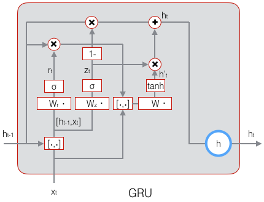
