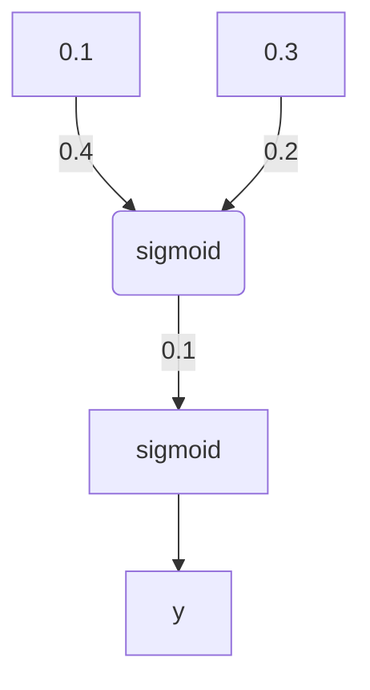

# 反向传播

首先以一个两层神经网络为例，可以使用链式法则计算输入层-隐藏层间权重的误差。

要使用梯度下降法更新隐藏层的权重，你需要知道各隐藏层节点的误差对最终输出的影响。每层的输出是由两层间的权重决定的，两层之间产生的误差，按权重缩放后在网络中向前传播。既然我们知道输出误差，便可以用权重来反向传播到隐藏层。

例如，输出层每个输出节点 k 的误差是 `math \delta_{o}^{k}` 隐藏节点 j 的误差即为输出误差乘以输出层-隐藏层间的权重矩阵（以及梯度）。

$$ \delta_{h}^{j} = \sum w_{jk}\delta_{k}^{o}f'(h_{j})$$ 然后，梯度下降与之前相同，只是用新的误差： $$ \Delta w_{ij} = \eta \delta_{j}^{h}x_{i} $$ 其中 $ w_{ij} $ 是输入和隐藏层之间的权重， $x_i$ 是输入值。这个形式可以表示任意层数。权重更新步长等于步长乘以层输出误差再乘以该层的输入值。 $ \Delta w_{pq} = \eta \delta_{output}V_{in} $

现在，有了输出误差，$\delta_{output}$，便可以反向传播这些误差了。$ V_{in} $ 是该层的输入，比如经过隐藏层激活函数的输出值。

## 范例

以一个简单的两层神经网络为例，计算其权重的更新过程。假设该神经网络包含两个输入值，一个隐藏节点和一个输出节点，隐藏层和输出层的激活函数都是 sigmoid，如下图所示。（注意：图底部的节点为输入值，图顶部的 $ \hat y$ 为输出值。输入层不计入层数，所以该结构被称为两层神经网络。）



假设训练一些二进制数据，目标值是 y=1。从正向传播开始，首先计算输入到隐藏层节点 $$ h = \sum_{i} w_{i}x_{i} = 0.1 _0.4 - 0.2_ 0.3 = -0.02$$ 以及隐藏层节点的输出 $$ a = f(h) = sigmoid(-0.02) = 0.495$$ 然后将其作为输出节点的输入，该网络的输出可表示为 $$ \hat y = f(W _a) = sigmoid(0.1_ 0.495)$$ 基于该神经网络的输出，就可以使用反向传播来更新各层的权重了。sigmoid函数的导数 $$ {f}'(W \cdot a) = f(W \cdot a)(1 - f(w \cdot a))$$, 输出节点的误差项（error term）可表示为 $$ \delta^o = (y-\hat y){f}'(W \cdot a) = (1-0.512) _0.512_ (1 - 0.512)$$ 基于该神经网络的输出，就可以使用反向传播来更新各层的权重了。sigmoid 函数的导数 现在要通过反向传播来计算隐藏节点的误差项。这里我们把输出节点的误差项与隐藏层到输出层的权重 W 相乘。隐藏节点的 误差项

$$ \delta _{j}^{h} = \sum_{k}W_{jk}\delta_{k}^{o}{f}'h_{j}$$ 。因为该案例只有一个隐藏节点， $$\delta ^{h} = W \delta ^{o}{f}'(h)= 0.1 _0.122_ 0.495 _(1-0.495) = 0.003$$ 有了误差，就可以计算梯度下降步长了。隐藏层-输出层权重更新步长是学习速率乘以输出节点误差再乘以隐藏节点激活值。 $$\Delta W=\eta\delta^{o}a=0.5_ 0.122 * 0.495=0.0302$$ 然后，输入-隐藏层权重$ w_{i}$是学习速率乘以隐藏节点误差再乘以输入值。 $$\Delta W_{i}=\eta\delta^{h}x_{i}=(0.5_0.003_0.1,0.5_0.003_0.3)=(0.00015,0.00045) $$ 从这个例子中你可以看到 sigmoid 做激活函数的一个缺点。sigmoid 函数导数的最大值是 0.25，因此输出层的误差被减少了至少 75%，隐藏层的误差被减少了至少 93.75%！如果你的神经网络有很多层，使用 sigmoid 激活函数会很快把靠近输入层的权重步长降为很小的值，该问题称作梯度消失。后面的课程中你会学到在这方面表现更好，也被广泛用于最新神经网络中的其它激活函数。

但是之前接触的只是单个节点的误差项。现在在更新权重时，我们需要考虑隐藏层 每个节点 的误差 $\delta_{j}$

$$ \Delta W_{ij}=\eta\delta_{j}x_{i}$$

```python
import numpy as np


def sigmoid(x):
    """
    Calculate sigmoid
    """
    return 1 / (1 + np.exp(-x))


x = np.array([0.5, 0.1, -0.2])
target = 0.6
learnrate = 0.5

weights_input_hidden = np.array([[0.5, -0.6],
                                 [0.1, -0.2],
                                 [0.1, 0.7]])

weights_hidden_output = np.array([0.1, -0.3])

## Forward pass
hidden_layer_input = np.dot(x, weights_input_hidden)
hidden_layer_output = sigmoid(hidden_layer_input)

output_layer_in = np.dot(hidden_layer_output, weights_hidden_output)
output = sigmoid(output_layer_in)

## Backwards pass
error = target - output

output_error_term = error * output * (1 - output)

hidden_error_term = np.dot(weights_hidden_output,output_error_term) * hidden_layer_output * (1 - hidden_layer_output)

delta_w_h_o = learnrate * output_error_term * hidden_layer_output

delta_w_i_h = learnrate * hidden_error_term * x[:, None]

print('hidden layer to output layer:')
print(delta_w_h_o)
print('input layer to hidden layer:')
print(delta_w_i_h)
```

## 再捋一遍

现在输出层的误差是

$$\delta_{k}=(y_{k}-\hat y_{k}){f}'(a_{k})$$ 隐藏层误差是

现在只考虑一个简单的神经网络，一个隐藏层和一个输出节点。通过反向传播方法传播更新权重

- 把每一层权重更新的初始步长设置为 0

  - 输入到隐藏层的权重更新是 $ \Delta W_{ij}=0$
  - 隐藏层到输出层的权重更新是 $ \Delta W_{j}=0$

- 对训练数据当中的每一个点

  - 让它正向通过网络，计算输出$ \hat y$
  - 计算输出节点的误差梯度 $ \delta^{o}=(y-\hat y){f}'(z)$这里$ z=\sum_{j}W_{i}a_{j}$
  - 误差传播到隐藏层 $\delta_{j}^{h}=\delta^{o}{f}'(h_{j})$
  - 更新步长:

    - 1.$\Delta W=\Delta W + \delta^{o}a_{j}$
    - 2.$\Delta w_{ij}=w_{ij}+\delta_{j}^{h}$

- 更新权重, 其中 η 是学习率，m 是数据点的数量：

  - $W_{j}=W_{j}+\eta\Delta W_{j}/m$
  - $ w_{ij}=w_{ij}+\eta\Delta w_{ij}/m$

- 循环

### 看这里 ----> code show include data

backprob.py

```python
import numpy as np
from data_prep import features, targets, features_test, targets_test

np.random.seed(21)

def sigmoid(x):
    return 1 / (1 + np.exp(-x))


# Hyperparameters
n_hidden = 2  # number of hidden units
epochs = 1000
learnrate = 0.007

n_records, n_features = features.shape
last_loss = None
# Initialize weights
weights_input_hidden = np.random.normal(scale=1 / n_features ** .5,
                                        size=(n_features, n_hidden))
weights_hidden_output = np.random.normal(scale=1 / n_features ** .5,
                                         size=n_hidden)

for e in range(epochs):
    del_w_input_hidden = np.zeros(weights_input_hidden.shape)
    del_w_hidden_output = np.zeros(weights_hidden_output.shape)
    for x, y in zip(features.values, targets):
        ## Forward pass ##
        hidden_input = np.dot(x, weights_input_hidden)
        hidden_output = sigmoid(hidden_input)
        output = sigmoid(np.dot(hidden_output, weights_hidden_output))

        ## Backward pass ##
        error = y - output
        output_error_term = error * output * (1 - output)

        ## propagate errors to hidden layer
        hidden_error = np.dot(weights_hidden_output,output_error_term)
        hidden_error_term = hidden_error * hidden_output * (1 - hidden_output)

        print(hidden_error_term.shape)
        print(x.shape)
        del_w_hidden_output += output_error_term * hidden_output
        del_w_input_hidden += hidden_error_term * x[:,None]

    weights_input_hidden += learnrate * del_w_input_hidden / n_records
    weights_hidden_output += learnrate * del_w_hidden_output / n_records

    # Printing out the mean square error on the training set
    if e % (epochs / 10) == 0:
        hidden_output = sigmoid(np.dot(x, weights_input_hidden))
        out = sigmoid(np.dot(hidden_output,
                             weights_hidden_output))
        loss = np.mean((out - targets) ** 2)

        if last_loss and last_loss < loss:
            print("Train loss: ", loss, "  WARNING - Loss Increasing")
        else:
            print("Train loss: ", loss)
        last_loss = loss

# Calculate accuracy on test data
hidden = sigmoid(np.dot(features_test, weights_input_hidden))
out = sigmoid(np.dot(hidden, weights_hidden_output))
predictions = out > 0.5
accuracy = np.mean(predictions == targets_test)
print("Prediction accuracy: {:.3f}".format(accuracy))
```

data_prep.py

```python
import numpy as np
import pandas as pd

admissions = pd.read_csv('data.csv')

# Make dummy variables for rank
data = pd.concat([admissions, pd.get_dummies(admissions['rank'], prefix='rank')], axis=1)
data = data.drop('rank', axis=1)

# Standarize features
for field in ['gre', 'gpa']:
    mean, std = data[field].mean(), data[field].std()
    data.loc[:,field] = (data[field]-mean)/std

# Split off random 10% of the data for testing
np.random.seed(21)
sample = np.random.choice(data.index, size=int(len(data)*0.9), replace=False)
data, test_data = data.ix[sample], data.drop(sample)

# Split into features and targets
features, targets = data.drop('admit', axis=1), data['admit']
features_test, targets_test = test_data.drop('admit', axis=1), test_data['admit']
```

data.csv

```python
admit,gre,gpa,rank
0,380,3.61,3
1,660,3.67,3
1,800,4,1
1,640,3.19,4
0,520,2.93,4
1,760,3,2
1,560,2.98,1
0,400,3.08,2
1,540,3.39,3
0,700,3.92,2
0,800,4,4
0,440,3.22,1
1,760,4,1
0,700,3.08,2
1,700,4,1
0,480,3.44,3
0,780,3.87,4
0,360,2.56,3
0,800,3.75,2
1,540,3.81,1
0,500,3.17,3
1,660,3.63,2
0,600,2.82,4
0,680,3.19,4
1,760,3.35,2
1,800,3.66,1
1,620,3.61,1
1,520,3.74,4
1,780,3.22,2
0,520,3.29,1
0,540,3.78,4
0,760,3.35,3
0,600,3.4,3
1,800,4,3
0,360,3.14,1
0,400,3.05,2
0,580,3.25,1
0,520,2.9,3
1,500,3.13,2
1,520,2.68,3
```
