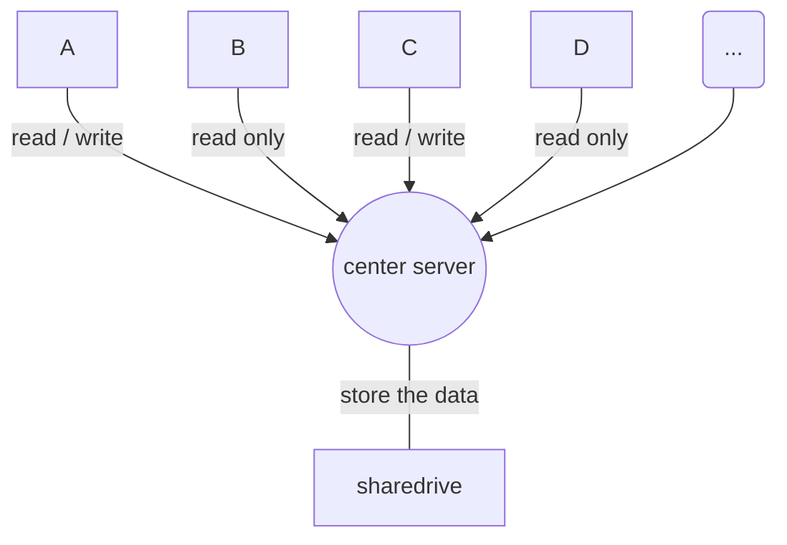
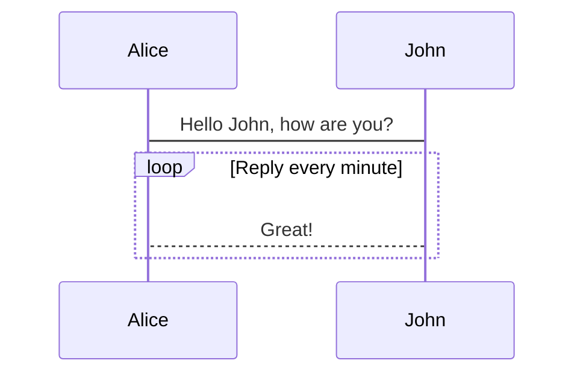
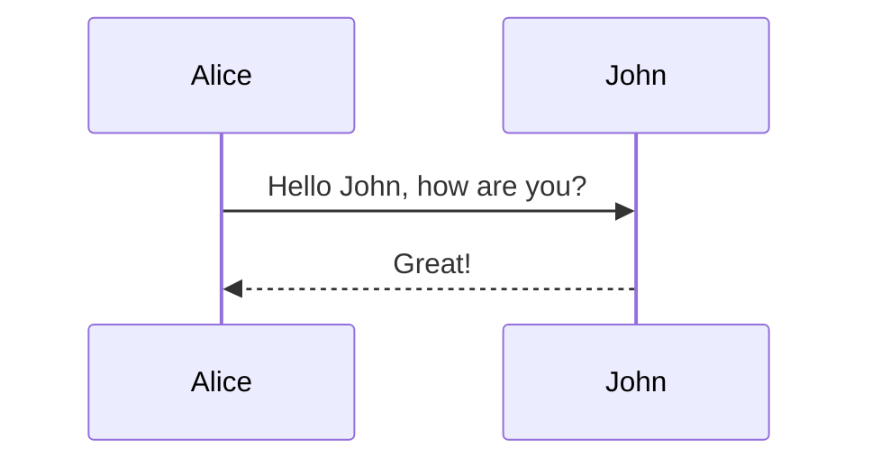
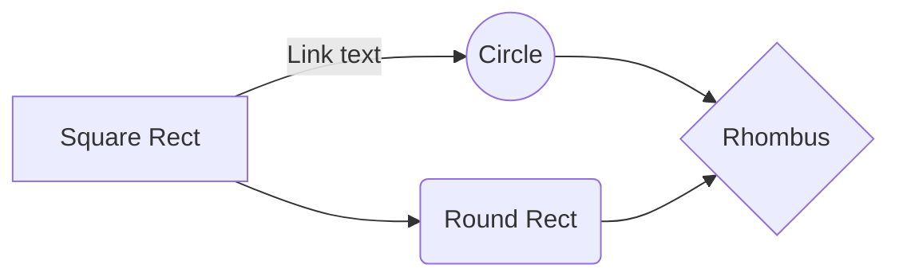
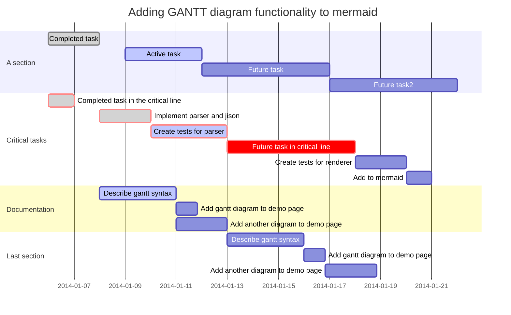
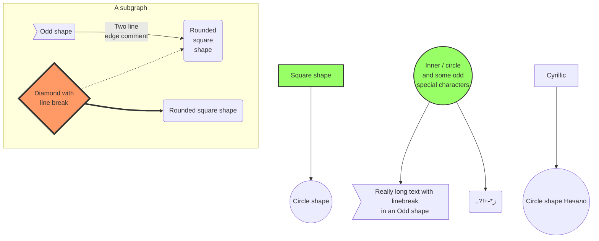

**Math**

$\sum_{i=0}^{100} i$ $f(x) = sin(x) + 12 $ $Wt=\prod \sum_{sf}^{s}$ $$ \begin{align} 2x - 5y = 8 3x + 9y = -12 \end{align} $$  <https://shd101wyy.github.io/markdown-preview-enhanced/#/zh-cn/markdown-basics>   

> We're living the future so the present is our past.

如下，三个或者更多的

--------------------------------------------------------------------------------

连字符

--------------------------------------------------------------------------------

星号

--------------------------------------------------------------------------------

下划线

Content [^1]

[^1]\: Hi! This is a footnote

`<addr>` 才对。

```{gnuplot output:"html", id:"chj3p9gbg3"} set terminal svg set title "Simple Plots" font ",20" set key left box set samples 50 set style data points

plot [-10:10] sin(x),atan(x),cos(atan(x))

````

```python3 {.lineNo}
print("test !")
````

```{python matplotlib:true, id:"chj3p9eitf"} import matplotlib.pyplot as plt plt.plot([1,2,3, 4]) plt.show()

````

| First Header                  | Second Header                |
| ----------------------------- | ---------------------------- |
| Content from cell 1         区 | Content from cell 2          |
| Content in the first column   | Content in the second column |

```{gnuplot output:"html", id:"chj3p946sy"}
set terminal svg
set title "simple Plots" font ",20"
set key loft box
set samples 50
set style data points
plot [-10:10] sin(x), atan(x),cos(atan(x))
````

@import "<https://cdn.plot.ly/plotly-latest.min.js>"

````
```

```mermaid
graph TD;
    A-->B
    A-->C
    B-->D
    C-->D
````

@@@@@@@@@@@@@@@@@@@@@@@@@@@@@@@@@@@@@@@@@@@@

```mermaid
%% Example of sequence diagram
sequenceDiagram
    participant John
    participant Alice
    Alice->>John: Hello John, how are you?
    John-->>Alice: Great!
```

@@@@@@@@@@@@@@@@@@@@@@@@@@@@@@@@@@@@@@@@@@@





===============================@@@@@@@@@@@@



@@@@@@@@@@@@@@@@@@@@@@@@@@@@@

&&&&&&&&&&&&&&&&&&&&&&&&&&&&&&&&&&&






